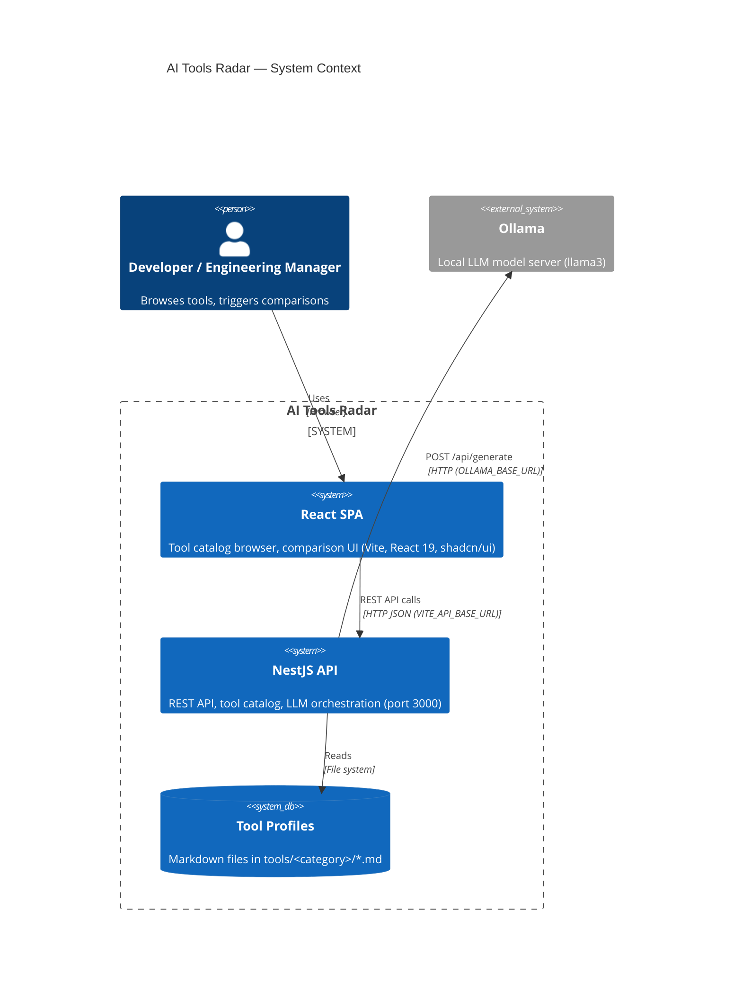
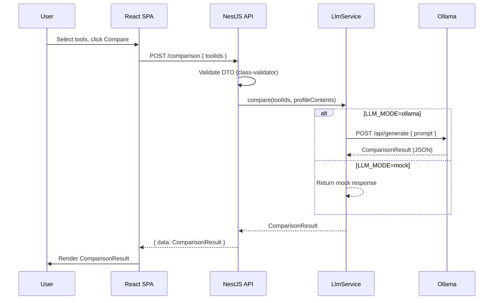

# System Architecture

## Overview

AI Tools Radar is a loose monorepo containing a NestJS REST API backend and a React SPA frontend. The backend serves tool catalog data (sourced from Markdown files) and orchestrates LLM-generated comparisons via Ollama. The frontend provides a browsable catalog UI and comparison interface. The two layers communicate exclusively via a typed REST API — neither knows the other's implementation details.

## Architecture Pattern

**Pattern**: Modular monorepo — NestJS feature modules (backend) + domain-grouped components (frontend)

The backend follows NestJS's module-per-feature convention: each domain (tools, comparison, LLM, health) lives in its own module with its own service, controller, and DTOs. Cross-cutting concerns (exception handling, response envelope, configuration) are registered globally in `AppModule`.

The frontend follows a feature-based component organization: UI primitives in `components/ui/`, domain components grouped by feature (`tools/`, `comparison/`, `layout/`), and shared logic in `lib/`.

## System Structure

### Backend (`backend/`)
- **Location**: `backend/src/`
- **Purpose**: REST API, tool catalog, LLM orchestration
- **Key Modules**:
  - `AppModule` — root module; registers config, global interceptor, exception filter
  - `ToolsModule` — `GET /tools`, `GET /tools/:id`; reads Markdown profiles from `tools/`
  - `ComparisonModule` — `POST /comparison`; orchestrates LLM analysis via `LlmService`
  - `LlmModule` — Ollama HTTP client with `mock`/`ollama` mode switching
  - `HealthModule` — `GET /health` via `@nestjs/terminus`
- **Cross-cutting**:
  - `GlobalExceptionFilter` — normalizes all errors to `ApiErrorResponse` shape
  - `TransformInterceptor` — wraps all success responses in uniform envelope
  - `AppConfig` + `OllamaConfig` — Joi-validated typed configuration

### Frontend (`frontend/`)
- **Location**: `frontend/src/`
- **Purpose**: SPA — tool catalog browser and comparison UI
- **Key Files**:
  - `lib/api.ts` — typed HTTP client (uses `VITE_API_BASE_URL`)
  - `lib/config.ts` — environment variable access
  - `types/tool.ts`, `types/comparison.ts` — shared TypeScript interfaces mirroring API contracts
  - `routes/ToolsPage.tsx` — catalog browse route (`/`)
  - `routes/ComparisonResultPage.tsx` — comparison results route (`/compare`)
  - `components/tools/` — `ToolCard`, `ToolList`
  - `components/comparison/` — `ComparisonPanel`, `ComparisonResult`
  - `components/ui/` — shadcn/ui primitives, `EmptyState`, `LoadingState`

### Tool Profiles (`tools/`)
- **Location**: `tools/<category>/<tool-name>.md`
- **Purpose**: Primary data source — structured Markdown profiles for each AI tool
- **Current categories**: `cli/`
- **Convention**: Evidence-based, structured schema; append-only updates with dated sections

## Visual Architecture Context

## Data Flow

### Tool Catalog Flow
1. User opens the app → React SPA loads
2. `ToolsPage` mounts → `api.ts` calls `GET /tools`
3. Backend `ToolsController` delegates to `ToolsService`
4. `ToolsService` reads and parses Markdown files from `tools/<category>/`
5. Returns `Tool[]` — frontend renders `ToolList` with `ToolCard` per tool

### Comparison Flow
1. User selects tools → clicks "Compare"
2. `ComparisonPanel` calls `POST /comparison` with `{ toolIds: string[] }`
3. `ComparisonController` validates request via DTO + class-validator
4. `ComparisonService` loads tool profile content for each `toolId`
5. `LlmService` builds prompt and calls Ollama (`LLM_MODE=ollama`) or returns mock (`LLM_MODE=mock`)
6. Ollama streams/returns structured analysis
7. `ComparisonResult` is returned and rendered on `ComparisonResultPage`

## Component Communication Flow

## External Integrations

| Integration | Protocol | Config Vars | Notes |
|---|---|---|---|
| **Ollama** | HTTP REST (`POST /api/generate`) | `OLLAMA_BASE_URL`, `OLLAMA_MODEL`, `OLLAMA_API_KEY`, `OLLAMA_TIMEOUT_MS` | Local only; `LLM_MODE=mock` bypasses entirely |

## Configuration

All configuration is environment-driven:

| Layer | Source | Validation |
|---|---|---|
| Backend | `.env` (gitignored) · `.env.example` (template) | Joi schema in `env.validation.ts`; crashes at startup on invalid/missing vars |
| Frontend | `.env` (gitignored) · `.env.example` (template) | `VITE_` prefix required for Vite exposure; accessed via `lib/config.ts` |

Key backend vars: `PORT`, `NODE_ENV`, `CORS_ORIGINS`, `LLM_MODE`, `OLLAMA_BASE_URL`, `OLLAMA_MODEL`, `OLLAMA_TIMEOUT_MS`

Key frontend vars: `VITE_API_BASE_URL`

## API Contract

| Endpoint | Method | Request | Response |
|---|---|---|---|
| `/health` | GET | — | `{ status: string }` |
| `/tools` | GET | — | `Tool[]` |
| `/tools/:id` | GET | — | `Tool` |
| `/comparison` | POST | `{ toolIds: string[] }` | `ComparisonResult` |

All responses wrapped in `TransformInterceptor` envelope. Errors return `ApiErrorResponse { statusCode, error, message, timestamp, path }`.

## Deployment Architecture

Not configured. Planned approach:
- `docker-compose.yml` for local dev (frontend on 5173, backend on 3000, Ollama on 11434)
- No cloud deployment target defined — local-first by design

---
*Based on codebase analysis performed 2026-05-24*
