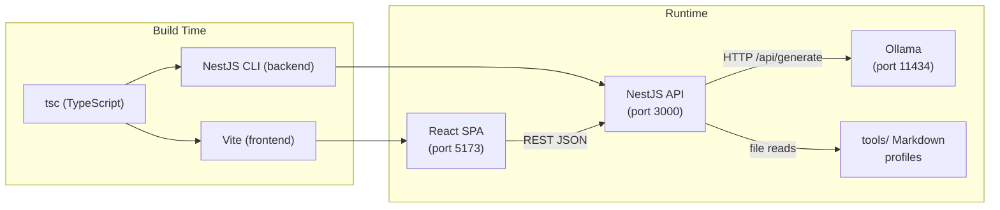

# Technology Stack

## Overview

This document describes the technology choices and rationale for AI Tools Radar.

## Visual Stack Flow



## Languages

### TypeScript (~6.0 frontend / ^5.7 backend)
- **Usage**: 100% of source code
- **Rationale**: End-to-end type safety across frontend and backend; enables shared type contracts for API payloads. TypeScript 6 on frontend for cutting-edge ESM support.
- **Key Features Used**: Strict mode (frontend), `nodenext` module resolution (backend), decorators for NestJS dependency injection, path aliases (`@/`) on frontend

## Frameworks

### Frontend

| Technology | Version | Rationale |
|---|---|---|
| **React** | ^19.2.6 | Industry-standard component model; concurrent features for responsive UI |
| **Vite** | ^8.0.12 | Fast HMR, native ESM, minimal config; replaces CRA/Webpack for DX |
| **React Router** | ^7.15.1 | Declarative client-side routing for SPA navigation |
| **Tailwind CSS** | ^3.4.19 | Utility-first styling; integrates with shadcn/ui CSS variable token system |
| **shadcn/ui** | (Radix UI primitives) | Accessible, unstyled component primitives with full design system control |

### Backend

| Technology | Version | Rationale |
|---|---|---|
| **NestJS** | ^11.0.1 | Modular, decorator-based Node.js framework; enforces clean module boundaries |
| **Express** | (via @nestjs/platform-express) | Mature HTTP server adapter; default NestJS transport |
| **Axios** | ^1.16.1 | HTTP client for Ollama integration; interceptor support for error handling |
| **@nestjs/config + Joi** | ^4.0.4 / ^18.2.1 | Schema-validated environment configuration; crashes at startup on missing vars |
| **class-validator** | ^0.15.1 | Decorator-based DTO validation on incoming requests |
| **@nestjs/terminus** | ^11.1.1 | Structured `/health` endpoint for liveness checks |

### Testing

| Technology | Version | Rationale |
|---|---|---|
| **Jest** | ^30.0.0 | Backend unit and e2e test runner; NestJS default |
| **ts-jest** | — | TypeScript transformer for Jest |
| **Supertest** | ^7.0.0 | HTTP integration testing for NestJS e2e specs |

## LLM Integration

| Component | Detail |
|---|---|
| **Engine** | Ollama (local model server) |
| **Interface** | HTTP REST — `POST /api/generate` |
| **Default Model** | `llama3` (configurable via `OLLAMA_MODEL`) |
| **Modes** | `LLM_MODE=mock` (development / CI) · `LLM_MODE=ollama` (production) |
| **Config Vars** | `OLLAMA_BASE_URL`, `OLLAMA_MODEL`, `OLLAMA_API_KEY`, `OLLAMA_TIMEOUT_MS` |

## Data Layer

No traditional database. Data is stored as structured Markdown files:

```
tools/
└── <category>/          # e.g. cli/, ide/, agent/
    └── <tool-name>.md   # One file per tool, standardized schema
```

- `ToolsService` reads and parses these files at runtime
- Category directories map directly to UI navigation categories
- Adding a tool = creating a Markdown file (no backend code changes required)

## Build Tools & Package Management

| Tool | Usage |
|---|---|
| **npm** | Package manager (separate `package.json` per workspace) |
| **Vite** | Frontend build (`tsc -b && vite build`) |
| **NestJS CLI** | Backend build (`nest build`) |
| **tsc** | TypeScript compilation (both frontend and backend) |

## Infrastructure

### Containerization
Not configured. Planned: `docker-compose.yml` for one-command local dev (frontend + backend + Ollama).

### CI/CD
Not configured. Planned: GitHub Actions for lint → test → build pipeline.

### Hosting
Not configured. Target: self-hosted / local-first.

## Development Tools

### Linting & Formatting

| Tool | Config |
|---|---|
| **ESLint 9–10** | Flat config (`eslint.config.mjs` / `eslint.config.js`) |
| **typescript-eslint** | TypeScript-aware linting rules |
| **Prettier** | `singleQuote: true`, `trailingComma: all` (backend `.prettierrc`) |
| **eslint-config-prettier** | Disables conflicting ESLint formatting rules |

### Type Checking
- Frontend: strict TypeScript via `tsconfig.app.json` (project references pattern)
- Backend: partial strict (`strictNullChecks: true`, `noImplicitAny: false`) — can be tightened once stubs are replaced

## Key Dependencies

### Frontend
```
react ^19.2.6 · react-router ^7.15.1 · tailwindcss ^3.4.19
@radix-ui/react-checkbox · @radix-ui/react-slot
class-variance-authority · tailwind-merge · clsx
lucide-react ^1.16.0
```

### Backend
```
@nestjs/core ^11.0.1 · @nestjs/platform-express
@nestjs/config ^4.0.4 · @nestjs/terminus ^11.1.1
axios ^1.16.1 · class-validator ^0.15.1 · class-transformer ^0.5.1
joi ^18.2.1
```

## Version Management

- No workspace tooling (no `npm workspaces`, `nx`, or `turbo`)
- Dependencies managed independently in `frontend/` and `backend/`
- Planned: evaluate `npm workspaces` or `turbo` for unified scripts at root

---
*Last Updated: 2026-05-24*
*Auto-detected: tech stack, versions, config files, directory structure, testing setup*
*User-provided: project description, target users*
