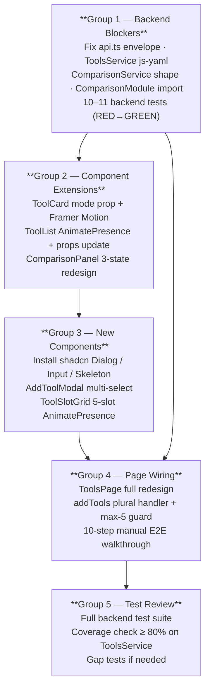

# Implementation Plan: EPIC 3 — Tool Selection Workspace

**Date**: 2026-05-24  
**Issue**: https://github.com/plucins/ai-tools-radar/issues/3  
**Risk Level**: HIGH  
**Spec**: `implementation/spec.md`  
**Spec Audit**: `verification/spec-audit.md`

---

## Overview

| | |
|---|---|
| **Total Task Groups** | 5 |
| **Total Implementation Steps** | ~36 |
| **Backend Tests** | 10–11 (tools.service.spec.ts: 7, comparison.service.spec.ts: 3) |
| **Frontend Tests** | 0 — no Vitest/RTL infrastructure; frontend verified manually |
| **Has Testing Group** | Yes (Group 5) |

### Spec Audit Decisions Baked Into This Plan

All findings from `verification/spec-audit.md` have been resolved with the following decisions:

| Audit Finding | Decision |
|---|---|
| **C1** — `data/tools/` path wrong | Use `path.join(__dirname, '..', '..', '..', '..', 'data', 'tools')` — `__dirname` from `dist/src/tools/` |
| **H1** — Single vs multi-select | Follow `spec.md`: `pendingIds: Set<string>` (multi-select confirmed in requirements.md Phase 5) |
| **H2** — `ComparisonModule` missing `ToolsModule` | Add `ToolsModule` to `comparison.module.ts` imports in Group 1 |
| **H3** — Already-selected tools in modal | Follow `requirements.md`: show as **disabled/checked**, not hidden — pass `disabled={selectedIds.has(t.id)}` without filtering them out |
| **M1** — `ConfigService` missing from `ComparisonService` | Inject `ConfigService`; use `this.configService.get<string>('ollama.mode')` |
| **M2** — `ToolList` interface for modal | Update `ToolListProps` to accept `mode?`, `pendingIds?`, `disabledIds?` alongside existing props |
| **M4** — `addTool(id)` vs `addTools(ids[])` | Use plural `addTools(ids: string[])` in `ToolsPage` state; guards total count `selectedIds.size + ids.length <= 5` |
| **M3** — Progress bar `w-full` vs `90%` | Follow `spec.md`: `w-full` at `'generating'` stage |
| **L2** — Slot insertion order | Use `[...selectedIds].map(id => tools.find(t => t.id === id)!)` to preserve user-selection order |
| **L3** — `LoadingState` vs slot Skeletons | Show slot grid immediately with `Skeleton` per empty slot while `loading=true`; remove full-page `<LoadingState>` from redesigned page |

---

## Implementation Steps

---

### Task Group 1 — Backend Blockers
**Dependencies:** None  
**Estimated Steps:** 11  
**Risk:** HIGH — all UI work depends on correct data flow end-to-end

> ⚠️ This group must complete and pass its tests before any other group begins. Three end-to-end data bugs block the entire frontend.

- [x] 1.0 Complete backend blocker fixes
  - [x] 1.1 Write `tools.service.spec.ts` — 7 tests covering all parsing behaviours
    - **Test 1**: `findAll() returns parsed tools from markdown files` — run against real `data/tools/**/*.md` in the repo; assert non-empty `Tool[]` with `id`, `name`, `category`, `tags` present
    - **Test 2**: `findAll() generates id from filename slug` — `claude-code.md` → `id === 'claude-code'`
    - **Test 3**: `findAll() resolves js-yaml block scalar description` — multi-line `>` block scalar collapses to single-line string (no leading `\n`)
    - **Test 4**: `findOne(id) returns correct tool by id` — `findOne('claude-code')` returns tool with `name === 'Claude Code'`
    - **Test 5**: `findOne(id) throws NotFoundException for unknown id` — `findOne('nonexistent')` throws `NotFoundException`
    - **Test 6**: `findAll() skips files with missing required fields` — create temp fixture with no `name` field; assert full list still returns without throw
    - **Test 7**: `findAll() skips files with invalid yaml` — fixture with broken YAML (e.g. `name: [unclosed`); assert graceful degradation, no throw
    - File: `src/backend/src/tools/tools.service.spec.ts` (new)
    - Follow AAA structure; use actual fixture files or `fs.mkdtempSync` temp directory to avoid filesystem mocks
    - `describe('ToolsService')` / `it('...')` naming per testing-standards.md
  - [x] 1.2 Add `comparison.service.spec.ts` tests — 3 tests verifying new return shape
    - **Test 8**: `compare() returns result with tools matching input toolIds`
    - **Test 9**: `compare() returns generatedAt as valid ISO 8601 string`
    - **Test 10**: `compare() mock summary contains tool names` — `summary` string includes the name strings resolved from toolIds
    - Add/update in `src/backend/src/comparison/comparison.service.spec.ts`
    - These tests will fail (RED) until steps 1.5–1.7 are implemented
  - [x] 1.3 Install `js-yaml` backend dependencies
    - From `src/backend/`: `npm install js-yaml && npm install --save-dev @types/js-yaml`
    - Verify `package.json` shows `js-yaml: ^4.1.0` in `dependencies`, `@types/js-yaml: ^4.0.9` in `devDependencies`
  - [x] 1.4 Fix `api.ts` envelope unwrap — `src/frontend/src/lib/api.ts`
    - Locate the `request<T>()` generic method (around line 16)
    - The backend `TransformInterceptor` wraps all responses as `{ data: T, timestamp: string }`
    - Change: instead of returning the raw response body, return `response.data` (or `envelope.data` after typing the wrapper)
    - Type the envelope: `interface ApiEnvelope<T> { data: T; timestamp: string }`
    - After fix: `tools.list()` returns `Tool[]` directly; `comparison.compare()` returns `ComparisonResult` directly
    - **This is a 2-line change that touches ALL existing API callers** — verify `ComparisonResultPage` still works after
  - [x] 1.5 Implement `ToolsService` — `src/backend/src/tools/tools.service.ts`
    - Extend `Tool` interface with `category: string`, `tags: string[]`, `profilePath?: string`
    - Add `private readonly tools: Tool[]` property; populate in constructor (synchronous, one-time)
    - File discovery: `path.join(__dirname, '..', '..', '..', '..', 'data', 'tools')` — **do NOT use `process.cwd()`** (spec-audit C1)
    - Walk subdirectories one level: `fs.readdirSync(toolsRoot).forEach(subdir → readdirSync(subdir path))` — filter `.md` only
    - YAML extraction regex: `` /```yaml\n([\s\S]*?)```/ `` applied to raw file string; Group 1 is YAML string
    - Parse with `js-yaml.load(yamlString)` — resolves `>` block scalars automatically
    - ID: `path.basename(file, '.md')`
    - `profilePath`: `path.relative(path.join(__dirname, '..', '..', '..', '..'), fullFilePath)` — yields `data/tools/cli/claude-code.md`
    - Error handling: wrap each file in try/catch; `Logger.warn()` on read error, YAML error, or missing required fields; skip file; **never throw**
    - Implement `findAll(): Tool[]` → returns `this.tools`
    - Implement `findOne(id: string): Tool` → find by id; throw `NotFoundException` if missing
    - `ToolsModule` already has `exports: [ToolsService]` — no change needed there
  - [x] 1.6 Fix `ComparisonService` — `src/backend/src/comparison/comparison.service.ts`
    - Export updated `ComparisonResult` interface: `{ tools: string[]; summary: string; generatedAt: string }`
    - Inject `ToolsService` and `ConfigService` into constructor (spec-audit M1)
    - Read mode: `this.mode = this.configService.get<string>('ollama.mode') ?? 'mock'` — **no `process.env`**
    - `compare(dto)` method: resolve tool names via `this.toolsService.findOne(id).name` (fallback to `id` if `NotFoundException`)
    - Mock summary format: `"Mock comparison of Tool1 vs Tool2 (and N more). [Mock mode — LLM not running.]"` (omit "and N more" when only 2 tools)
    - Return `{ tools: dto.toolIds, summary, generatedAt: new Date().toISOString() }`
  - [x] 1.7 Fix `ComparisonModule` — `src/backend/src/comparison/comparison.module.ts`
    - Add `imports: [ToolsModule]` to the `@Module` decorator (spec-audit H2)
    - Add `import { ToolsModule } from '../tools/tools.module'` at top
    - Without this, NestJS DI throws `Nest can't resolve dependencies of ComparisonService` at startup
  - [x] 1.8 Run backend tests — confirm Group 1 passes
    - From `src/backend/`: `npm run test -- --testPathPattern="tools.service|comparison.service"`
    - Expect: all 10 tests pass (7 tools.service + 3 comparison.service)
    - Expect: `≥ 80%` line coverage on `ToolsService`
    - Fix any failures before proceeding to Group 2
  - [x] 1.9 Smoke-test backend manually
    - Start NestJS: `npm run start:dev` from `src/backend/`
    - `curl http://localhost:3000/tools` — expect JSON array with 3 tools (claude-code, github-copilot-cli, opencode), each with `id`, `name`, `description`, `category`, `tags`, `profilePath`
    - `curl -X POST http://localhost:3000/comparison -H 'Content-Type: application/json' -d '{"toolIds":["claude-code","github-copilot-cli"]}'` — expect `{ data: { tools: [...], summary: "Mock comparison of...", generatedAt: "..." }, timestamp: "..." }`

**Acceptance Criteria:**
- All 10 backend tests pass (7 `tools.service.spec.ts` + 3 `comparison.service.spec.ts`)
- `≥ 80%` line coverage on `ToolsService`
- `GET /tools` returns 3 real `Tool[]` objects with `category` and `tags` populated
- `POST /comparison` returns `{ tools: string[], summary: string, generatedAt: string }` (inside the envelope)
- `api.ts` correctly unwraps `{ data: T, timestamp }` envelope → callers receive `T` directly
- NestJS starts without DI errors

---

### Task Group 2 — Component Extensions
**Dependencies:** Group 1 (api.ts fix must be in place so UI can fetch real data)  
**Estimated Steps:** 8  
**Note:** Frontend has no test infrastructure (Vitest/RTL not configured — out of scope). Verification is via manual browser testing and TypeScript compiler (`tsc --noEmit`).

- [x] 2.0 Complete component extensions
  - [x] 2.1 Define verification checklist (run before marking 2.0 done)
    - **Check A**: `tsc --noEmit` in `src/frontend/` passes with 0 errors after all changes
    - **Check B**: Dev server renders `ToolCard mode="slot"` with X button (no TypeScript errors)
    - **Check C**: Dev server renders `ToolCard mode="browser"` with selection ring when `selected=true`
    - **Check D**: `ToolList` renders with `AnimatePresence` stagger — cards fade/scale in on first load
    - **Check E**: `ComparisonPanel` renders all 3 visual states correctly (disabled / active / in-progress)
  - [x] 2.2 Enhance `ToolCard` — `src/frontend/src/components/tools/ToolCard.tsx`
    - Add `mode: 'slot' | 'browser'` to `ToolCardProps` interface (required, no default)
    - Add `selected?: boolean`, `onRemove?: (id: string) => void`, `onToggle?: (id: string) => void`, `disabled?: boolean`
    - Wrap root element in `motion.div` from `framer-motion`:
      `whileHover={{ scale: 1.02 }} whileTap={{ scale: 0.98 }} transition={{ duration: 0.15 }}`
      (matches `SidebarNavItem.tsx` pattern)
    - Card root must be `relative` (for absolute-positioned X / CheckCircle2)
    - Apply `bg-card/50 backdrop-blur-sm border-border/50` to card background
    - **Slot mode** (`mode="slot"`):
      - Always apply `ring-2 ring-primary` (tool is in a slot = selected by definition)
      - Render `Button variant="ghost" size="icon"` at `absolute top-2 right-2`; icon: `X` from lucide-react
      - `onClick={() => onRemove?.(tool.id)}` on X button
      - `aria-label={`Remove ${tool.name} from comparison`}` on X button
      - Category `Badge variant="secondary"` below title
      - Description: `line-clamp-2` class
    - **Browser mode** (`mode="browser"`):
      - Apply `ring-2 ring-primary` only when `selected=true`
      - When `selected=true`: render `CheckCircle2` icon at `absolute top-2 right-2` (`text-primary`)
      - When `disabled=true`: add `opacity-40 pointer-events-none cursor-not-allowed`
      - `onClick={() => onToggle?.(tool.id)}` on card (clicking a pending card deselects it)
    - Remove any existing `Checkbox` usage from `ToolCard` (spec: Checkbox no longer used)
    - Import new Lucide icons: `X`, `CheckCircle2`
  - [x] 2.3 Update `ToolList` props interface — `src/frontend/src/components/tools/ToolList.tsx`
    - Update `ToolListProps` interface (spec-audit M2):
      ```typescript
      interface ToolListProps {
        tools: Tool[]
        mode?: 'browser'             // drives ToolCard mode prop
        selectedIds?: Set<string>    // legacy (unused after ToolsPage redesign)
        pendingIds?: Set<string>     // modal browser-mode selection rings
        disabledIds?: Set<string>    // max-5 enforcement: merged selectedIds + over-limit tools
        onToggle?: (id: string) => void
      }
      ```
    - Pass `mode={mode ?? 'browser'}` to each `ToolCard` child
    - `selected` derived: `pendingIds?.has(tool.id) ?? selectedIds?.has(tool.id) ?? false`
    - `disabled` derived: `disabledIds?.has(tool.id) ?? false`
    - Wrap the card list render in `AnimatePresence` from `framer-motion`
    - Each card wrapped in `motion.div`:
      `key={tool.id}` (required for AnimatePresence)
      `initial={{ opacity: 0, scale: 0.9 }}`
      `animate={{ opacity: 1, scale: 1, transition: { duration: 0.2 } }}`
      `exit={{ opacity: 0, scale: 0.9, transition: { duration: 0.15 } }}`
    - Stagger: use `transition={{ delay: index * 0.05 }}` on `animate` for entrance
  - [x] 2.4 Redesign `ComparisonPanel` — `src/frontend/src/components/comparison/ComparisonPanel.tsx`
    - Replace entire component (full redesign — retain only the file)
    - Props: `{ selectedCount: number; loading: boolean; stage: ComparisonStage; onCompare: () => void }`
    - Type: `type ComparisonStage = null | 'gathering' | 'comparing' | 'generating'`
    - **State A** (`selectedCount < 2`, `!loading`):
      - Container: `border border-border/30 bg-secondary/20 rounded-xl p-5 opacity-50`
      - Body text: "Select at least 2 tools to start comparing"
      - Button: `<Button disabled>Start Comparing</Button>`
    - **State B** (`selectedCount >= 2`, `!loading`):
      - Container: `border border-primary/30 bg-primary/10 rounded-xl p-5 shadow-[0_0_20px_hsl(var(--primary)/0.2)]`
      - Icon: `Sparkles` (lucide-react)
      - Text: `{selectedCount} tools selected · Ready for AI analysis`
      - If `selectedCount === 5`: append `<p className="text-xs text-muted-foreground mt-1">Slots full — remove a tool to add another</p>`
      - Button: `<Button size="lg" onClick={onCompare}>Start Comparing</Button>`
    - **State C** (`loading=true`):
      - Same neon border as State B + pulsing glow
      - Icon: `Loader2` (animate-spin)
      - 3-stage progress bar (CSS `transition-all duration-500 ease-out`):
        - `'gathering'` → `w-1/3`
        - `'comparing'` → `w-2/3`
        - `'generating'` → `w-full`
      - Stage indicators row (3 items: "Gathering metadata", "Comparing features", "Generating summary"):
        - Pending: `○` text-muted-foreground
        - Active: `●` text-primary animate-pulse
        - Done: `<CheckCircle2 className="text-green-500" />`
      - Button: `<Button disabled>Comparing...</Button>`
    - Import: `Loader2`, `CheckCircle2`, `Sparkles` from lucide-react
  - [x] 2.5 TypeScript check — run `tsc --noEmit` from `src/frontend/`
    - Fix all type errors before proceeding
    - Ensure `ToolCard` is not called anywhere without the required `mode` prop

**Acceptance Criteria:**
- `tsc --noEmit` passes in `src/frontend/` with 0 errors
- `ToolCard mode="slot"` renders X remove button; `ToolCard mode="browser"` renders selection ring + CheckCircle2 when `selected=true`
- `ToolCard` with `disabled=true` renders at `opacity-40` with `pointer-events-none`
- `ToolList` card entrance has stagger fade-in animation (`AnimatePresence` + `motion.div`)
- `ComparisonPanel` visually shows 3 distinct states: dimmed (< 2), neon glow (≥ 2), spinner + progress (loading)
- No console errors in browser dev tools

---

### Task Group 3 — New Components
**Dependencies:** Group 2 (ToolCard and ToolList must be enhanced before AddToolModal uses them)  
**Estimated Steps:** 9  
**Note:** Frontend has no test infrastructure. Verification is TypeScript compiler + manual browser inspection.

- [x] 3.0 Complete new component creation
  - [x] 3.1 Define verification checklist (run before marking 3.0 done)
    - **Check A**: `tsc --noEmit` passes after all component files created
    - **Check B**: `AddToolModal` opens via direct prop `isOpen={true}` in a test render; shows search input and category pills
    - **Check C**: Typing in modal search field filters the tool grid in real time
    - **Check D**: Clicking a tool card in modal adds selection ring (CheckCircle2); clicking again deselects
    - **Check E**: "Add Selected (N)" button disabled when `pendingIds.size === 0`; enabled with correct count `N` when tools are staged
    - **Check F**: `ToolSlotGrid` with `loading=true` renders 5 skeleton placeholders
    - **Check G**: `ToolSlotGrid` with 0 `selectedTools` and `loading=false` renders 5 empty dashed-border slots
    - **Check H**: `ToolSlotGrid` with 2 `selectedTools` renders 2 `ToolCard mode="slot"` + 3 empty slots
  - [x] 3.2 Install shadcn components — run from `src/frontend/`
    - `npx shadcn@latest add dialog` → creates `src/frontend/src/components/ui/dialog.tsx`
    - `npx shadcn@latest add input` → creates `src/frontend/src/components/ui/input.tsx`
    - `npx shadcn@latest add skeleton` → creates `src/frontend/src/components/ui/skeleton.tsx`
    - Verify all 3 files exist after install
    - Commit these generated files before writing custom component code
  - [x] 3.3 Create `AddToolModal` — `src/frontend/src/components/tools/AddToolModal.tsx`
    - Named export: `export function AddToolModal({ tools, selectedIds, isOpen, onClose, onAddTools }: AddToolModalProps)`
    - Interface:
      ```typescript
      interface AddToolModalProps {
        tools: Tool[]
        selectedIds: Set<string>
        isOpen: boolean
        onClose: () => void
        onAddTools: (ids: string[]) => void
      }
      ```
    - Internal state: `query: string`, `activeCategory: string` (default `'All'`), `pendingIds: Set<string>`
    - Reset `pendingIds` to `new Set()` when modal opens: `useEffect(() => { if (isOpen) setPendingIds(new Set()) }, [isOpen])`
    - Category pills: `['All', ...new Set(tools.map(t => t.category))]` — active pill uses `Badge variant="default"`, inactive uses `Badge variant="outline"` + `cursor-pointer onClick`
    - Filtering (spec-audit H3 — show disabled, not hidden):
      ```typescript
      const filteredTools = tools.filter(t =>
        (activeCategory === 'All' || t.category === activeCategory)
        && (query === ''
          || t.name.toLowerCase().includes(query.toLowerCase())
          || t.description.toLowerCase().includes(query.toLowerCase())
          || t.tags.some(tag => tag.toLowerCase().includes(query.toLowerCase()))))
      ```
    - Already-selected tools are **NOT** filtered out — pass `disabled={selectedIds.has(t.id) || (selectedIds.size + pendingIds.size >= 5 && !pendingIds.has(t.id))}` to `ToolCard` (spec-audit H3)
    - `pendingIds` toggle: `if (pendingIds.has(id)) remove; else if (selectedIds.size + pendingIds.size < 5) add`
    - Dialog structure:
      - `DialogContent className="max-w-2xl"` (shadcn)
      - `DialogHeader`: title "Add Tools", description "Select tools to compare (max 5 total)"
      - `Input` (shadcn) with `Search` icon prefix; `value={query}` `onChange`
      - `Separator`
      - Category pills row: `flex flex-wrap gap-2`
      - Tool grid: `grid grid-cols-1 gap-3 md:grid-cols-2 max-h-[50vh] overflow-y-auto`
      - Render `ToolList` inside grid with `mode="browser"`, `tools={filteredTools}`, `pendingIds`, `disabledIds` (computed set), `onToggle`
      - `EmptyState` when `filteredTools.length === 0` (title: "No tools found", description: "Try a different search term or category.")
      - Footer: left `text-xs text-muted-foreground`: "Showing {filteredTools.length} tools"; right: Cancel `Button variant="outline"` + "Add Selected ({pendingIds.size})" `Button disabled={pendingIds.size === 0}`
    - Confirm handler: `onAddTools([...pendingIds]); onClose()`
    - Import: `Search`, `Plus` from lucide-react; all shadcn Dialog, Input; `ToolList`, `Tool` type; `EmptyState`, `Badge`, `Separator`, `Button`
  - [x] 3.4 Create `ToolSlotGrid` — `src/frontend/src/components/tools/ToolSlotGrid.tsx`
    - Named export: `export function ToolSlotGrid({ tools, selectedTools, loading, onRemove, onOpenModal }: ToolSlotGridProps)`
    - Interface:
      ```typescript
      interface ToolSlotGridProps {
        tools: Tool[]
        selectedTools: Tool[]
        loading: boolean
        onRemove: (id: string) => void
        onOpenModal: () => void
      }
      ```
    - Render exactly 5 slots: `Array.from({ length: 5 }, (_, i) => selectedTools[i] ?? null)`
    - Wrap ALL 5 slots in `<AnimatePresence mode="popLayout">` from framer-motion
    - Each slot is a `motion.div` keyed by `tool?.id ?? \`empty-${i}\``
    - Motion props: `initial={{ opacity: 0, scale: 0.9 }}` `animate={{ opacity: 1, scale: 1 }}` `exit={{ opacity: 0, scale: 0.9 }}`; durations 200ms / 150ms per spec
    - Slot resolution:
      - `tool !== null` → `<ToolCard tool={tool} mode="slot" onRemove={onRemove} />`
      - `tool === null && loading` → `<Skeleton className="h-[180px] w-full rounded-xl" />`
      - `tool === null && !loading` → `<EmptySlot slotNumber={i + 1} onClick={onOpenModal} />`
    - `EmptySlot` sub-component (can be local to file, not exported):
      - `border-2 border-dashed border-border/50 rounded-xl` with `min-h-[180px]` and `cursor-pointer`
      - Center content: `Plus` icon `h-6 w-6 text-muted-foreground`, "Add a tool" text, "Slot {n} of 5" text
      - Disabled styling when parent disables (see Group 4 wiring)
    - Grid container: `grid grid-cols-1 gap-4 md:grid-cols-2 lg:grid-cols-3`
    - Import: `AnimatePresence`, `motion` from framer-motion; `Skeleton` from `@/components/ui/skeleton`; `ToolCard`; `Plus` from lucide-react
  - [x] 3.5 TypeScript check — `tsc --noEmit` from `src/frontend/`
    - Fix all errors (missing props, wrong types, missing imports)
    - Pay special attention to `Set` serialization — sets must be passed as `Set<string>` not arrays

**Acceptance Criteria:**
- `tsc --noEmit` passes in `src/frontend/` with 0 errors
- `AddToolModal`: search filters tool grid in real time; multi-select with `pendingIds`; "Add Selected (N)" count correct; already-selected tools shown as disabled (not hidden)
- `ToolSlotGrid`: shows 5 skeleton cards while `loading=true`; shows 5 empty dashed slots when `loading=false` and no selection; fills slots left-to-right with `ToolCard mode="slot"` as tools are added
- `AnimatePresence` animations work on slot add/remove (scale + fade)
- shadcn `Dialog`, `Input`, `Skeleton` files exist in `src/frontend/src/components/ui/`

---

### Task Group 4 — Page Wiring
**Dependencies:** Groups 1, 2, 3 (all components must exist before the page can import them)  
**Estimated Steps:** 8  
**Note:** Frontend has no test infrastructure. Full end-to-end verification via running the app.

- [x] 4.0 Complete ToolsPage redesign and end-to-end wiring
  - [x] 4.1 Define end-to-end acceptance test cases (manual checklist — run in browser before marking 4.0 done)
    - **E2E-1**: Visit `/` → 5 dashed empty slots visible; no loading spinner; page title hero rendered
    - **E2E-2**: Click empty slot → `AddToolModal` opens with all 3 tools in grid
    - **E2E-3**: Type "claude" in search → only Claude Code shown
    - **E2E-4**: Select Claude Code + GitHub Copilot CLI in modal → "Add Selected (2)" button enabled → click → 2 slots fill with `ToolCard mode="slot"`
    - **E2E-5**: `ComparisonPanel` activates with neon glow (≥ 2 selected)
    - **E2E-6**: Click X on Claude Code card → slot returns to empty; CTA dims if < 2 remain
    - **E2E-7**: With 2+ tools, click "Start Comparing" → 3-stage progress bar animates → navigates to `/compare` with mock result
    - **E2E-8**: Kill backend → visit `/` → `Alert variant="destructive"` shown with error message
    - **E2E-9**: Add tools until 5 slots full → `+ Add Tool` button disabled; empty slots show disabled cursor
    - **E2E-10**: Open modal with 5 tools selected → all unselected tools show `opacity-40` (max reached)
  - [x] 4.2 Redesign `ToolsPage` — `src/frontend/src/routes/ToolsPage.tsx`
    - **Remove** all old code; start from scratch (it's a full redesign)
    - State variables:
      ```typescript
      const [tools, setTools] = useState<Tool[]>([])
      const [loading, setLoading] = useState(true)
      const [error, setError] = useState<string | null>(null)
      const [selectedIds, setSelectedIds] = useState<Set<string>>(new Set())
      const [isModalOpen, setIsModalOpen] = useState(false)
      const [comparing, setComparing] = useState(false)
      const [stage, setStage] = useState<ComparisonStage>(null)
      ```
    - `selectedTools: Tool[]` derived (spec-audit L2 — insertion order):
      `[...selectedIds].map(id => tools.find(t => t.id === id)).filter(Boolean) as Tool[]`
    - `useEffect` for initial data fetch:
      - `setLoading(true)` → `api.tools.list()` → `setTools(data)` → `setLoading(false)`
      - `catch`: `setError(err instanceof Error ? err.message : 'Failed to load tools')` → `setLoading(false)`
    - `addTools(ids: string[])` handler (spec-audit M4):
      ```typescript
      const addTools = (ids: string[]) => {
        setSelectedIds(prev => {
          const next = new Set(prev)
          for (const id of ids) {
            if (next.size < 5) next.add(id)
          }
          return next
        })
        setIsModalOpen(false)
      }
      ```
    - `removeTool(id: string)` handler: `setSelectedIds(prev => { const next = new Set(prev); next.delete(id); return next })`
    - `handleCompare()` handler:
      - Guard: `if (selectedIds.size < 2 || comparing) return`
      - `setComparing(true)`; `setStage('gathering')`
      - `setTimeout(() => setStage('comparing'), 400)`
      - `setTimeout(() => setStage('generating'), 1200)`
      - `api.comparison.compare({ toolIds: [...selectedIds] })` (async)
      - On success: `navigate('/compare', { state: { result } })`; `setComparing(false)`; `setStage(null)`
      - On error: `setError(err instanceof Error ? err.message : 'Comparison failed')`; `setComparing(false)`; `setStage(null)`
    - Render structure:
      ```
      <div className="container mx-auto px-4 py-8 space-y-8">
        {/* Hero block */}
        <div className="flex items-center justify-between">
          <div>
            <h1 ...>AI Tools Radar</h1>
            <p ...>Select up to 5 tools to compare with AI analysis</p>
          </div>
          <Button
            onClick={() => setIsModalOpen(true)}
            disabled={selectedIds.size >= 5}
          >
            <Plus className="mr-2 h-4 w-4" /> Add Tool
          </Button>
        </div>

        {/* Error alert */}
        {error && (
          <Alert variant="destructive">
            <AlertTitle>Error</AlertTitle>
            <AlertDescription>{error}</AlertDescription>
          </Alert>
        )}

        {/* Empty catalog state */}
        {!loading && !error && tools.length === 0 && (
          <EmptyState title="No tools available" description="No tool profiles found in the backend." />
        )}

        {/* Slot grid — rendered immediately; slots show Skeleton while loading */}
        {(loading || tools.length > 0) && (
          <div>
            <p className="text-sm text-muted-foreground mb-3">
              Selected tools ({selectedIds.size}/5)
            </p>
            <ToolSlotGrid
              tools={tools}
              selectedTools={selectedTools}
              loading={loading}
              onRemove={removeTool}
              onOpenModal={() => setIsModalOpen(true)}
            />
          </div>
        )}

        {/* CTA block — only show when tools are loaded */}
        {!loading && tools.length > 0 && (
          <ComparisonPanel
            selectedCount={selectedIds.size}
            loading={comparing}
            stage={stage}
            onCompare={handleCompare}
          />
        )}

        {/* Add Tool Modal */}
        <AddToolModal
          tools={tools}
          selectedIds={selectedIds}
          isOpen={isModalOpen}
          onClose={() => setIsModalOpen(false)}
          onAddTools={addTools}
        />
      </div>
      ```
    - All imports use `@/` alias (frontend-standards.md): `@/components/tools/ToolSlotGrid`, etc.
    - `ComparisonStage` type imported from `@/components/comparison/ComparisonPanel`
    - `useNavigate` from `react-router-dom` for navigation to `/compare`
  - [x] 4.3 Verify `ComparisonResultPage` still works after api.ts fix
    - Navigate to `/compare` after a comparison — ensure it receives `ComparisonResult` correctly
    - If `ComparisonResultPage` was relying on the OLD (un-unwrapped) response shape, update it to use the new unwrapped shape
  - [x] 4.4 TypeScript check — final `tsc --noEmit` from `src/frontend/`
    - Zero errors required before E2E testing
  - [x] 4.5 Run E2E manual test cases (E2E-1 through E2E-10 from step 4.1)
    - Start both backend and frontend dev servers
    - Walk through each E2E test case; note any failures
    - Fix issues discovered during E2E walkthrough
  - [x] 4.6 Backend lint / type check
    - From `src/backend/`: `npm run build` (tsc compilation check)
    - Fix any TypeScript errors in backend files

**Acceptance Criteria:**
- All 10 E2E manual test cases pass in browser without console errors
- `tsc --noEmit` passes in both `src/frontend/` and `src/backend/`
- `GET /tools` returns real tool data (3 tools with category + tags)
- `/` renders 5-slot workspace; full flow (discover → select → compare → result) works end-to-end
- Error states surface as `Alert variant="destructive"` components — no silent failures
- Max-5 enforcement: `+ Add Tool` disabled at 5; modal disables additional tools at capacity
- Mock comparison navigates to `/compare` with interpolated summary

---

### Task Group 5 — Test Review & Gap Analysis
**Dependencies:** All previous groups (1–4)  
**Estimated Steps:** 5  
**Note:** Backend tests only (frontend test infrastructure out of scope).

- [x] 5.0 Review and fill critical test gaps
  - [x] 5.1 Re-run the full backend test suite
    - From `src/backend/`: `npm run test`
    - Capture pass/fail counts; note any regressions in pre-existing tests
    - Target: all tests pass (existing + the 10 new tests from Group 1)
  - [x] 5.2 Review coverage report
    - From `src/backend/`: `npm run test -- --coverage --testPathPattern="tools.service|comparison.service"`
    - Verify `ToolsService` line coverage `≥ 80%`
    - Identify any uncovered branches in `ToolsService` (error handling paths are high value)
  - [x] 5.3 Analyse gaps — write up to 10 additional strategic tests
    - Focus on `ToolsService` error-handling branches not yet covered:
      - File with no YAML fenced block (no regex match)
      - File with empty YAML block
      - `tools/` subdirectory is empty (no `.md` files)
      - Tool with `tags` as a single string instead of array (malformed YAML)
    - Focus on `ComparisonService`:
      - `compare()` with a toolId that doesn't exist in `ToolsService` (fallback to id in summary)
    - Maximum 10 additional tests — do not inflate test suite beyond what adds real value
  - [x] 5.4 Run feature-specific tests one final time
    - `npm run test -- --testPathPattern="tools.service|comparison.service"` from `src/backend/`
    - Expect: all tests (original 10 + any additions from 5.3) pass
  - [x] 5.5 Final smoke-test checklist
    - Backend: `curl http://localhost:3000/tools` → non-empty Tool array
    - Frontend: visit `/`, add 2 tools, click "Start Comparing", verify navigation to `/compare`
    - Confirm no `console.warn` / `console.error` output in NestJS terminal during normal operation

**Acceptance Criteria:**
- Full backend test suite passes (0 regressions in pre-existing tests)
- `ToolsService` line coverage `≥ 80%`
- All new + existing tests pass
- No more than 10 additional tests added in this group
- Final smoke-test (end-to-end comparison flow) passes without errors

---

## Execution Order

1. **Group 1 — Backend Blockers** (11 steps) — no dependencies; start here
2. **Group 2 — Component Extensions** (8 steps) — depends on Group 1 (api.ts fix)
3. **Group 3 — New Components** (9 steps) — depends on Group 2 (ToolCard + ToolList enhanced)
4. **Group 4 — Page Wiring** (8 steps) — depends on Groups 1 + 2 + 3
5. **Group 5 — Test Review & Gap Analysis** (5 steps) — depends on all previous groups

---

## Dependency Graph

```
Group 1 (Backend Blockers)
  └──▶ Group 2 (Component Extensions)
         └──▶ Group 3 (New Components)
                └──▶ Group 4 (Page Wiring)
                       └──▶ Group 5 (Test Review)
```

---

## Standards Compliance

Follow standards from `.flowbit/docs/standards/`:

### Frontend Standards (`frontend-standards.md`)
- shadcn-first: use `Dialog`, `Input`, `Skeleton`, `Button`, `Badge`, `Card`, `Alert` from `@/components/ui/`
- PascalCase filenames: `ToolSlotGrid.tsx`, `AddToolModal.tsx`
- Named exports only: `export function ComponentName` (no `export default`)
- Props interfaces: `interface ComponentNameProps { ... }` (not `type`)
- `@/` alias for all internal imports (no `../../../`)
- Tailwind tokens only: no hardcoded hex colors; use `hsl(var(--primary))` etc.
- Framer Motion: `whileHover`/`whileTap` on interactive cards matching `SidebarNavItem.tsx` pattern
- Error narrowing: `err instanceof Error ? err.message : 'Fallback'`
- All 3 async states handled: loading (skeleton), error (Alert), success (content)

### Backend Standards (`backend-standards.md`)
- Feature-per-module: `tools/` module contains service + controller + spec
- DTOs in `dto/` subdirectory
- Kebab-case filenames: `tools.service.ts`, `tools.service.spec.ts`
- Relative imports within module; absolute-style for cross-module (`../tools/tools.module`)
- `ConfigService` only — **no `process.env` access** (spec-audit M1)
- `interface` over `type` for exported types (e.g. `Tool`, `ComparisonResult`)
- NestJS `Logger` for warnings/errors — **no `console.log`/`console.warn`**

### Testing Standards (`testing-standards.md`)
- AAA structure: Arrange / Act / Assert per test
- Colocated `.spec.ts` files: `tools.service.spec.ts` lives next to `tools.service.ts`
- `describe('ToolsService', () => { it('...', () => { ... }) })`
- `jest.resetAllMocks()` in `afterEach`
- No real HTTP calls in unit tests
- `≥ 80%` line coverage target for `ToolsService`

### Coding Standards (`coding-standards.md`)
- `const` by default (not `let`)
- `unknown` over `any` for untyped data
- Explicit return types on public methods: `findAll(): Tool[]`, `findOne(id: string): Tool`
- External imports before internal imports
- Conventional commits: `feat(tools): implement ToolsService with js-yaml parsing`

---

## Execution Diagram

Task group dependency flow (strictly linear — no parallelism):



---

## Notes

- **Test-Driven**: Group 1 writes tests first (RED), then implements (GREEN) — the only group with automated tests
- **Frontend has no test infra**: Groups 2–4 verified via `tsc --noEmit` + manual browser E2E walkthrough
- **Run incrementally**: Only run `tools.service|comparison.service` tests, not the entire suite, until Group 5
- **Mark progress**: Check off steps as completed; `implementation-plan.md` is the source of truth for resume
- **Reuse first**: `ToolCard`, `ToolList`, `ComparisonPanel`, `EmptyState`, `LoadingState`, `Alert`, `Button`, `Badge`, `Card`, `Separator` are all in-codebase — no new UI primitives except the 3 shadcn installs
- **Critical path is linear**: Each group strictly depends on the previous; no parallelism possible
- **Spec audit decisions embedded**: All 10 audit findings (C1 through L3) are resolved in the step descriptions above — implementors should NOT re-consult `spec.md` lines that contradict the decisions table at the top of this plan
