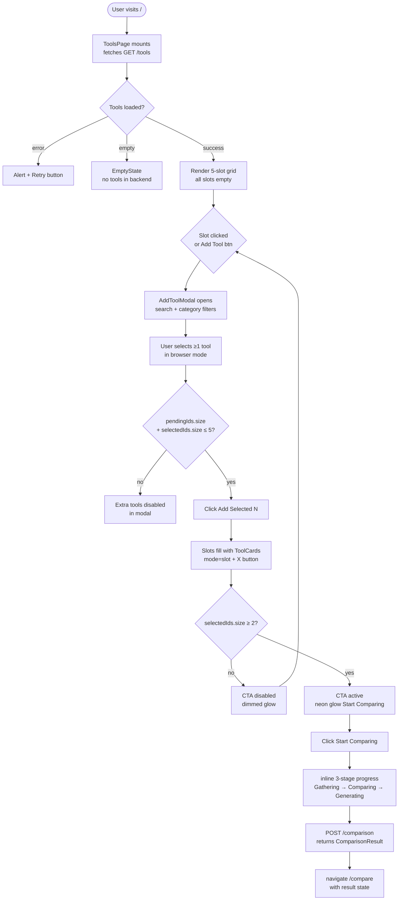
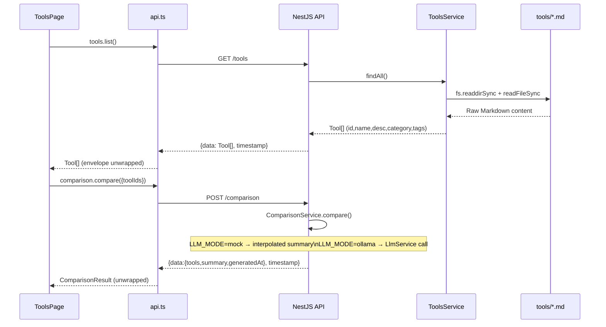
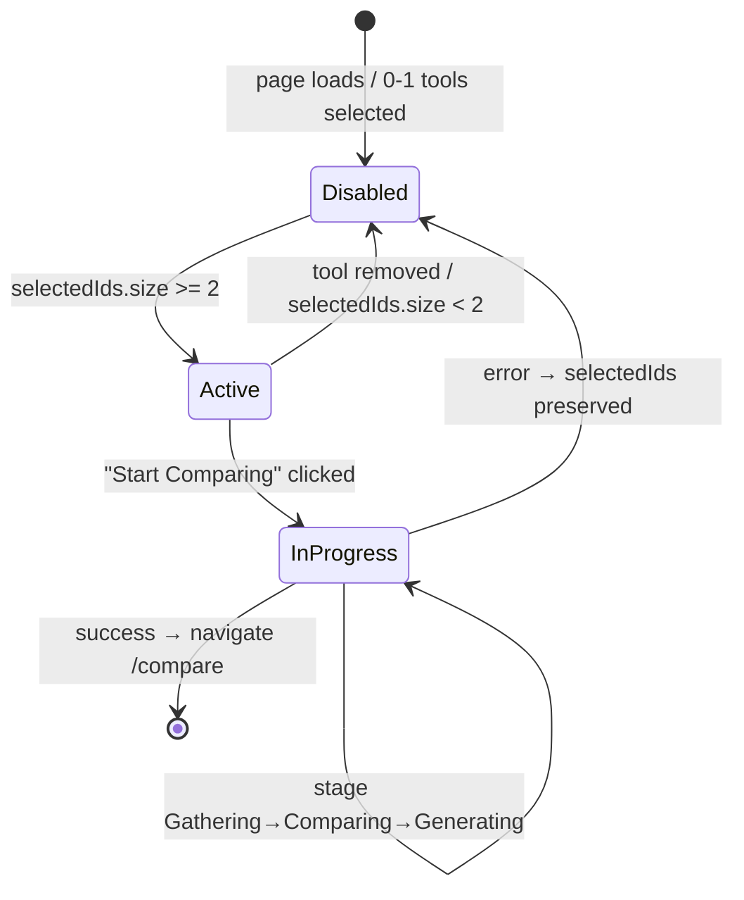

# Specification: EPIC 3 — Tool Selection Workspace

**Date**: 2026-05-24  
**Issue**: https://github.com/plucins/ai-tools-radar/issues/3  
**Risk Level**: HIGH  

---

## Goal

Implement the Tool Selection Workspace — a slot-based interactive area at `/` where users discover AI developer tools via a modal browser, select up to 5 for comparison, and launch AI analysis through the NestJS backend and Ollama LLM. Three critical data-flow bugs (API envelope, empty ToolsService, ComparisonResult shape mismatch) must be resolved first; the remaining work is a full ToolsPage redesign plus targeted enhancements to existing components.

---

## User Stories

- As a developer, I want to see 5 selection slots so I know exactly how many tools I can compare at once.
- As a developer, I want to browse tools in a modal with search and category filters so I can quickly find the tool I need.
- As a developer, I want to remove a tool from a slot with a single click so I can swap it for another.
- As a developer, I want real-time feedback while the AI analysis is running so I know the system is working.
- As a developer, I want the comparison button to be disabled until I pick at least 2 tools so I can't accidentally submit an invalid request.

---

## Scope

### In Scope
- Fix blocker B1: `api.ts` `TransformInterceptor` envelope unwrap
- Fix blocker B2: `ToolsService` — parse `tools/**/*.md` YAML frontmatter at startup using `js-yaml`
- Fix blocker B3: `ComparisonService` — align response shape to `{tools, summary, generatedAt}`
- `ToolsPage` full redesign: Hero → 5-slot grid (`ToolSlotGrid`) → CTA block (`ComparisonPanel`)
- `ToolCard` enhancement: `mode: 'slot' | 'browser'` prop, Framer Motion animations, X remove button (slot mode), selection ring + CheckCircle2 (browser mode)
- `ToolSlotGrid` new component: 5 fixed slots rendered as array, AnimatePresence, Skeleton loading state
- `AddToolModal` new component: shadcn Dialog, search Input, category Badge filters, multi-select flow
- `ComparisonPanel` redesign: 3-state (disabled/active/in-progress), 3-stage inline progress bar
- `ToolList` enhancement: `AnimatePresence` + stagger for card entrance in modal
- Extend backend `Tool` interface: add `category`, `tags`, `profilePath` fields
- Install new dependencies: `js-yaml` (backend), shadcn `Dialog`, `Input`, `Skeleton` (frontend)

### Out of Scope
- `GET /tools/:id` detail page / tool profile viewer
- User authentication or saved comparisons
- Pagination or infinite scroll for tool catalog
- Tool CRUD (add/edit/delete via UI)
- LLM integration changes (mock mode is sufficient)
- Sorting controls
- Frontend test infrastructure setup (no Vitest/RTL configured; backend unit tests only)

---

## Architecture

### System Context (unchanged)

```
User (browser)
    │  HTTP JSON
    ▼
React SPA (Vite, port 5173)
    │  REST via api.ts → VITE_API_BASE_URL
    ▼
NestJS API (port 3000)
    │  fs.readdirSync   │  POST /comparison → LlmService
    ▼                   ▼
tools/**/*.md       Ollama (LLM_MODE=ollama) / Mock (LLM_MODE=mock)
```

### Component Tree (ToolsPage after redesign)

```
ToolsPage  [routes/ToolsPage.tsx]
├── Hero block (inline JSX)
│     ├── Title + subtitle
│     └── Button "+ Add Tool"  → sets isModalOpen=true
│
├── ToolSlotGrid  [components/tools/ToolSlotGrid.tsx]  ← NEW
│     └── (Array of 5)
│           ├── <EmptySlot>   (if no tool in slot i)   → onClick: isModalOpen=true
│           ├── <Skeleton>    (if loading)
│           └── ToolCard      mode="slot"  → onRemove: removeTool(id)
│
├── ComparisonPanel  [components/comparison/ComparisonPanel.tsx]  ← REDESIGNED
│     ├── STATE A: disabled (<2 tools)
│     ├── STATE B: active (≥2 tools, neon glow)  → handleCompare()
│     └── STATE C: in-progress (comparing=true, 3-stage bar)
│
└── AddToolModal  [components/tools/AddToolModal.tsx]  ← NEW
      ├── Dialog (shadcn) + DialogHeader + DialogFooter
      ├── Input (shadcn) — search field
      ├── Badge pills — category filter
      ├── Separator
      ├── ToolList (mode="browser") — filtered tool grid
      │     └── ToolCard  mode="browser"  → onClick: toggles pendingIds
      └── "Add Selected (N)" Button — calls onAddTools([...pendingIds])
```

### Primary User Flow



### API Call Sequence



### Comparison CTA State Machine



---

## Files to Create / Modify

### New Files

| File | Responsibility |
|---|---|
| `src/frontend/src/components/tools/ToolSlotGrid.tsx` | Renders 5-slot grid; AnimatePresence for add/remove; Skeleton on load; EmptySlot placeholders |
| `src/frontend/src/components/tools/AddToolModal.tsx` | shadcn Dialog with search, category filters, ToolCard browser grid, multi-select flow |
| `src/backend/src/tools/tools.service.spec.ts` | Unit tests for ToolsService Markdown parsing and query methods |

### Modified Files

| File | Change Summary |
|---|---|
| `src/frontend/src/lib/api.ts` | Unwrap `{ data: T, timestamp }` envelope before returning (2-line fix) |
| `src/frontend/src/routes/ToolsPage.tsx` | Full redesign: state + handlers; renders Hero, ToolSlotGrid, ComparisonPanel, AddToolModal |
| `src/frontend/src/components/tools/ToolCard.tsx` | Add `mode: 'slot' \| 'browser'` prop; conditional X button vs selection ring; Framer Motion |
| `src/frontend/src/components/tools/ToolList.tsx` | Wrap card rendering in `AnimatePresence` + stagger (`initial/animate/exit`) |
| `src/frontend/src/components/comparison/ComparisonPanel.tsx` | Full redesign: 3-state UI, inline stage display, progress bar, neon glow |
| `src/backend/src/tools/tools.service.ts` | Scan `tools/**/*.md` at construction; parse YAML fenced block with `js-yaml`; extend `Tool` interface |
| `src/backend/src/comparison/comparison.service.ts` | Return `{ tools, summary, generatedAt }` aligned to frontend type; inject `ConfigService` for `LLM_MODE` check |
| `src/backend/src/comparison/comparison.module.ts` | Add `ToolsModule` to `imports` array so `ToolsService` is injectable in `ComparisonService` |

### shadcn Installs (frontend)

```bash
npx shadcn@latest add dialog    # AddToolModal overlay
npx shadcn@latest add input     # Search field in modal
npx shadcn@latest add skeleton  # Slot loading shimmer
```

These add component files to `src/frontend/src/components/ui/`.

---

## Component API (Props Interfaces)

### `ToolSlotGrid`

```typescript
interface ToolSlotGridProps {
  /** All fetched tools — passed through to AddToolModal */
  tools: Tool[]
  /** Currently selected tool objects in slot order */
  selectedTools: Tool[]
  /** True while initial tools fetch is in flight */
  loading: boolean
  /** Removes a tool from selectedIds by id */
  onRemove: (id: string) => void
  /** Opens the Add Tool modal */
  onOpenModal: () => void
}
```

**Behaviour**:
- Renders exactly 5 slots as `Array.from({ length: 5 }, (_, i) => selectedTools[i] ?? null)`
- Slot i filled → `ToolCard mode="slot"` with `onRemove`
- Slot i empty + loading → `Skeleton` shimmer
- Slot i empty + not loading → `EmptySlot` (dashed border, Plus icon, "Add a tool", "Slot N of 5"), `onClick → onOpenModal`
- `AnimatePresence mode="popLayout"` wraps the 5 slots; each keyed by `tool.id ?? `empty-${i}``

### `AddToolModal`

```typescript
interface AddToolModalProps {
  /** All available tools from API */
  tools: Tool[]
  /** IDs already occupying slots (shown as disabled in browser) */
  selectedIds: Set<string>
  /** True when the dialog should be open */
  isOpen: boolean
  /** Called when modal should close (Cancel or backdrop click) */
  onClose: () => void
  /** Called with array of tool ids to add to empty slots */
  onAddTools: (ids: string[]) => void
}
```

**Internal state**:
- `query: string` — search term, fuzzy-matched against `tool.name`, `tool.description`, `tool.tags` (case-insensitive `includes`)
- `activeCategory: string` — `'All'` or a specific category string derived from `[...new Set(tools.map(t => t.category))]`
- `pendingIds: Set<string>` — tools staged for add; reset to empty `Set` on modal open

**Filtering**:
```
filteredTools = tools.filter(t =>
  (activeCategory === 'All' || t.category === activeCategory) // category filter
  && (query === ''                                             // search filter
    || t.name.toLowerCase().includes(query.toLowerCase())
    || t.description.toLowerCase().includes(query.toLowerCase())
    || t.tags.some(tag => tag.toLowerCase().includes(query.toLowerCase()))))
// Already-selected tools are NOT filtered out; they are shown as disabled/dimmed via
// the `disabled` prop: disabled={selectedIds.has(t.id) || (selectedIds.size + pendingIds.size >= 5 && !pendingIds.has(t.id))}
```

**Footer**: "Add Selected (N)" button — `disabled={pendingIds.size === 0}`, `N = pendingIds.size`.  
**Confirm**: calls `onAddTools([...pendingIds])`, then `onClose()`.

**Max 5 enforcement in modal**: a tool in `filteredTools` is disabled (`disabled=true`) when `selectedIds.size + pendingIds.size >= 5 && !pendingIds.has(t.id)` — prevents staging beyond remaining slots.

### `ToolCard` (updated)

```typescript
interface ToolCardProps {
  tool: Tool
  /** Controls rendering mode:
   *  'slot'    — shows X remove button (top-right), no checkbox
   *  'browser' — shows selection ring + CheckCircle2 when selected, no X */
  mode: 'slot' | 'browser'
  /** Whether this card is currently selected (browser: ring; slot: always true) */
  selected?: boolean
  /** slot mode: called when X is clicked */
  onRemove?: (id: string) => void
  /** browser mode: called when card is clicked */
  onToggle?: (id: string) => void
  /** browser mode: true = already in selectedIds (disabled/dimmed) */
  disabled?: boolean
}
```

**Slot mode** (`mode="slot"`):
- Wraps in `motion.div` with `whileHover={{ scale: 1.02 }}`, `whileTap={{ scale: 0.98 }}`
- `ring-2 ring-primary` always applied (tool is selected by definition)
- X button: `Button variant="ghost" size="icon"` positioned `absolute top-2 right-2`, `onClick={() => onRemove?.(tool.id)}`
- `aria-label={`Remove ${tool.name} from comparison`}` on X button

**Browser mode** (`mode="browser"`):
- Same Framer Motion wrapper
- `ring-2 ring-primary` applied when `selected=true` (i.e., `pendingIds.has(tool.id)`)
- `CheckCircle2` icon absolute top-right when `selected=true`
- `disabled=true` → `opacity-40 pointer-events-none cursor-not-allowed` — for tools already in slots OR when slot limit reached
- `onClick={() => onToggle?.(tool.id)}` on the card (clicking a pending card again deselects it)

### `ComparisonPanel` (redesigned)

```typescript
interface ComparisonPanelProps {
  /** Number of tools in selectedIds */
  selectedCount: number
  /** True while POST /comparison is in flight */
  loading: boolean
  /** Active comparison stage (null = idle) */
  stage: ComparisonStage
  /** Triggers comparison */
  onCompare: () => void
}

type ComparisonStage = null | 'gathering' | 'comparing' | 'generating'
```

**State A** (`selectedCount < 2`): `opacity-50 border border-border/30 bg-secondary/20`, "Select at least 2 tools", disabled button.  
**State B** (`selectedCount >= 2`, `!loading`): `border border-primary/30 bg-primary/10 shadow-[0_0_20px_hsl(var(--primary)/0.2)]`, Sparkles icon, "{N} tools selected · Ready for AI analysis", active "Start Comparing" button.  
**State C** (`loading=true`): same neon border + pulsing glow; Loader2 spinning icon; 3-stage inline progress (see Stage State Machine).

**Max-reached hint** (when `selectedCount === 5`): append small text "Slots full — remove a tool to add another" below the status line.

**Stage State Machine** (driven from `ToolsPage`):
```
null → (handleCompare called) → 'gathering'
       (setTimeout ~400ms)    → 'comparing'
       (setTimeout ~800ms)    → 'generating'
       (API resolves)         → navigate('/compare')  [null reset]
       (API rejects)          → null + show error Alert
```
Progress bar widths: `'gathering'` → `w-1/3`, `'comparing'` → `w-2/3`, `'generating'` → `w-full`.  
CSS: `transition-all duration-500 ease-out`.

Stage indicator icons:
- Pending: circle `○` (`text-muted-foreground`)
- Active: circle `●` (`text-primary animate-pulse`)  
- Done: `CheckCircle2` (`text-green-500`)

---

## State Management (ToolsPage)

All state is local to `ToolsPage`. No global store.

```typescript
// Data
const [tools, setTools] = useState<Tool[]>([])
const [loading, setLoading] = useState(true)
const [error, setError] = useState<string | null>(null)

// Selection (ordered for slot positions)
const [selectedIds, setSelectedIds] = useState<Set<string>>(new Set())
// Note: order preserved via array derived from tools list filtered by selectedIds in insertion order

// Modal
const [isModalOpen, setIsModalOpen] = useState(false)

// Comparison
const [comparing, setComparing] = useState(false)
const [stage, setStage] = useState<ComparisonStage>(null)
```

**`addTools(ids: string[])`**: for each id guard `selectedIds.size < 5` before adding; add all ids to `selectedIds`; close modal. Wired as `onAddTools` on `AddToolModal`.  
**`removeTool(id: string)`**: delete from `selectedIds`.  
**`handleCompare()`**: sets `comparing=true`, drives `stage` through `'gathering' → 'comparing' → 'generating'` via `setTimeout`; calls `api.comparison.compare()`; on success `navigate('/compare', { state: { result } })`; on error sets `error` and resets `comparing/stage`.

**`selectedTools: Tool[]`** derived value: `tools.filter(t => selectedIds.has(t.id))` — preserves insertion order via `Set` iteration order (ES6 guaranteed).

---

## Reusable Components

### Existing Code to Leverage

| Component / Module | File | How Leveraged |
|---|---|---|
| `ToolCard` | `components/tools/ToolCard.tsx` | Extended in-place; existing `Card`, `CardHeader`, `CardContent`, `Badge` internals kept |
| `ToolList` | `components/tools/ToolList.tsx` | Used inside `AddToolModal` for the browser grid; enhanced with `AnimatePresence` |
| `ComparisonPanel` | `components/comparison/ComparisonPanel.tsx` | Redesigned in-place; no new file |
| `EmptyState` | `components/ui/EmptyState.tsx` | Reused as-is in modal empty search results (`title`, `description` props) |
| `LoadingState` | `components/ui/LoadingState.tsx` | Reused as-is for initial page load fallback |
| `Alert`, `AlertTitle`, `AlertDescription` | `components/ui/alert.tsx` | Error display above CTA; `variant="destructive"` |
| `Button` | `components/ui/button.tsx` | All buttons: `default sm` (Add Tool), `default lg` (Start Comparing), `ghost` (Cancel, Remove X) |
| `Badge` | `components/ui/badge.tsx` | Category pills in ToolCard and modal filter row; add `onClick` + `cursor-pointer` for interactive use |
| `Separator` | `components/ui/separator.tsx` | Divider between filters and tool grid in modal |
| `Card`, `CardHeader`, `CardContent`, `CardTitle`, `CardDescription` | `components/ui/card.tsx` | Slot card shell in `ToolCard` (unchanged) |
| `Checkbox` | `components/ui/checkbox.tsx` | Removed from `ToolCard`; no longer used in this EPIC |
| Framer Motion (`motion`, `AnimatePresence`) | `framer-motion` (already installed) | `ToolCard` hover/tap; `ToolSlotGrid` slot enter/exit; `ToolList` stagger |
| `SidebarNavItem` Framer Motion pattern | `components/layout/SidebarNavItem.tsx` | Template: `whileHover={{ scale: 1.02 }}`, `whileTap={{ scale: 0.98 }}` |
| `cn()` utility | `lib/utils.ts` | Conditional class composition on all components |

### New Components Required

| Component | Justification |
|---|---|
| `ToolSlotGrid` | No existing component manages 5-slot fixed-length grid with empty/skeleton/filled states and `AnimatePresence`. `ToolList` is an unbounded dynamic list — different concern. |
| `AddToolModal` | No existing modal or dialog component in the codebase. shadcn `Dialog` must be wired with domain-specific search, filter, and selection logic. |
| shadcn `Dialog`, `Input`, `Skeleton` | Missing from `components/ui/`; required by `AddToolModal` and loading states. Install via `npx shadcn@latest add`. |

---

## Backend: ToolsService Specification

### YAML Frontmatter Format

Tool Markdown files use a fenced YAML code block (NOT standard `---` frontmatter):

```
# Tool Name

```yaml
name: Claude Code
description: >
  Multi-line description text...
category: cli
tags:
  - Coding Agent
  - Developer Tools
```
```

Parse strategy: regex to extract the fenced block, then `js-yaml.load()`.

**Regex**: `` /```yaml\n([\s\S]*?)```/ `` applied to raw file content. Group 1 is the YAML string.

### Extended Tool Interface

```typescript
export interface Tool {
  id: string;          // slug from filename: claude-code.md → 'claude-code'
  name: string;        // from YAML: name
  description: string; // from YAML: description (block scalar resolved by js-yaml)
  category: string;    // from YAML: category
  tags: string[];      // from YAML: tags (list)
  profilePath?: string; // relative path: 'data/tools/cli/claude-code.md'
}
```

### File Discovery

- Root: `path.join(__dirname, '..', '..', '..', '..', 'data', 'tools')` — `__dirname` is the compiled file location (`dist/src/tools/`); climbing 4 levels reaches the repository root. Do **NOT** use `process.cwd()` — it resolves to `src/backend/` (not the repo root) and will produce an empty catalog with no startup error.
- Walk subdirectories one level deep: `data/tools/<category>/<tool-name>.md`
- Filter: only `.md` files
- Use synchronous `fs.readdirSync` at construction time (one-time startup cost; no async needed)
- `id` = filename without extension: `path.basename(file, '.md')`
- `profilePath` = relative path from repo root: `data/tools/<category>/<tool-name>.md` (derived via `path.relative(path.join(__dirname, '..', '..', '..', '..'), fullFilePath)`)

### Error Handling

- File read failure (permissions, corrupted file): log warning via NestJS `Logger`, skip the file, continue processing others
- YAML parse failure: log warning with file path, skip the file
- Missing required fields (`name`, `description`, `category`): log warning, skip the file
- Result: `ToolsService` always starts (no startup crash from bad tool files)

### ComparisonService Fix

```typescript
// src/backend/src/comparison/comparison.service.ts

export interface ComparisonResult {
  tools: string[];       // toolIds from DTO
  summary: string;       // interpolated mock or LLM output
  generatedAt: string;   // new Date().toISOString()
}

// Mock summary format (LLM_MODE=mock):
// "Mock comparison of Tool1 vs Tool2 (and N more). [Mock mode — LLM not running.]"
// Tool names resolved by calling this.toolsService.findOne(id).name (or id as fallback)
```

`ComparisonService` must inject `ToolsService` to resolve tool names for the mock summary.

---

## Visual Design

Visual mockups are in `analysis/ui-mockups.md`. Key design directives:

### Slot Grid (Mockups 2–5)
- Grid: `grid grid-cols-1 gap-4 md:grid-cols-2 lg:grid-cols-3`
- Empty slot: `border-2 border-dashed border-border/50 rounded-xl`, min-height matching filled cards, `Plus` icon (`h-6 w-6 text-muted-foreground`), "Add a tool" + "Slot N of 5" text, `cursor-pointer`
- Filled slot: `ring-2 ring-primary` always applied in slot mode
- Fidelity: pixel-approximate (not pixel-perfect); glassmorphic aesthetic required

### ToolCard (Mockup 3 + Mockup 5)
- `bg-card/50 backdrop-blur-sm border-border/50` for the card background
- Slot mode: category `Badge variant="secondary"` below title; `line-clamp-2` description; tag pills
- X button: `absolute top-2 right-2` (card must be `relative`)

### AddToolModal (Mockups 6–8)
- `DialogContent` max width ~`max-w-2xl`, max height `~80vh` with `overflow-y-auto` on tool grid
- Category filters: `flex flex-wrap gap-2` row; active pill: `Badge variant="default"`, inactive: `Badge variant="outline"`
- Tool grid: `grid-cols-1 gap-3 md:grid-cols-2` inside the scrollable area
- Footer: left-aligned "Showing N tools" count (`text-xs text-muted-foreground`), right-aligned Cancel + Confirm buttons

### ComparisonPanel (Mockup 9)
- State A: `border border-border/30 bg-secondary/20 rounded-xl p-5 opacity-50`
- State B: `border border-primary/30 bg-primary/10 rounded-xl p-5 shadow-[0_0_20px_hsl(var(--primary)/0.2)]`
- State C: same as B but with pulsing glow; Loader2 spinner + 3-stage progress bar

### Animations
- Slot add/remove (AnimatePresence): `initial={{ opacity: 0, scale: 0.9 }}` → `animate={{ opacity: 1, scale: 1 }}` → `exit={{ opacity: 0, scale: 0.9 }}`; durations 200ms / 150ms
- Card hover/tap (Framer Motion): `whileHover={{ scale: 1.02 }}`, `whileTap={{ scale: 0.98 }}`
- Progress bar: CSS `transition-all duration-500 ease-out`; width driven by stage state
- Modal: shadcn Dialog built-in slide-in; no custom Framer Motion needed

---

## Error Handling Strategy

| Error Source | Detection | User-Facing Response |
|---|---|---|
| `GET /tools` network/server error | `catch` in `ToolsPage` useEffect | `Alert variant="destructive"` with retry hint; `loading=false` |
| `POST /comparison` failure | `catch` in `handleCompare()` | `Alert variant="destructive"` above CTA; `comparing=false`, `stage=null` |
| Tool Markdown parse failure (backend) | Try/catch in `ToolsService` constructor | NestJS `Logger.warn()`; file skipped silently; partial catalog served |
| Empty catalog (all files fail) | `tools.length === 0` after load | `EmptyState` in page body (no slot grid shown) |
| Modal search empty results | `filteredTools.length === 0` | `EmptyState title="No tools found" description="Try a different search term or category."` |

Error messages follow the `err instanceof Error ? err.message : 'Fallback message'` pattern (frontend-standards.md).

---

## Test Requirements

Tests follow testing-standards.md: AAA structure, colocated `.spec.ts` files, Jest.

### Backend: `tools.service.spec.ts` (NEW — 6–8 tests)

**Target**: `ToolsService` — behavior-focused, no filesystem mocks where possible (use actual fixture files or temp files).

1. `findAll() returns parsed tools from markdown files` — given files on disk, returns non-empty `Tool[]` with correct `id`, `name`, `category`, `tags`
2. `findAll() generates id from filename slug` — `claude-code.md` → `id === 'claude-code'`
3. `findAll() resolves js-yaml block scalar description correctly` — multi-line `>` block scalar is collapsed to single-line string
4. `findOne(id) returns correct tool by id`
5. `findOne(id) throws NotFoundException for unknown id`
6. `findAll() skips files with missing required fields` — given a malformed MD file, `findAll()` returns remaining valid tools (no throw)
7. `findAll() skips files with invalid yaml` — graceful degradation on YAML parse error

### Backend: `comparison.service.spec.ts` (MODIFY — 2–3 tests)

1. `compare() returns result with tools matching input toolIds`
2. `compare() returns result with generatedAt as ISO string`
3. `compare() mock summary contains tool names`

> **Note**: Frontend has no test infrastructure (Vitest/RTL not configured). Frontend logic is verified end-to-end via the running app. Adding frontend test infrastructure is out of scope for this EPIC.

---

## Dependencies

### New Backend Dependencies

| Package | Version | Purpose |
|---|---|---|
| `js-yaml` | `^4.1.0` | Parse YAML fenced frontmatter in `.md` files |
| `@types/js-yaml` | `^4.0.9` | TypeScript types for `js-yaml` |

Install: `npm install js-yaml && npm install --save-dev @types/js-yaml` (from `src/backend/`)

### New Frontend Dependencies (via shadcn CLI)

| Package | Installed via | Purpose |
|---|---|---|
| `@radix-ui/react-dialog` | `npx shadcn@latest add dialog` | AddToolModal overlay primitive |
| shadcn `input.tsx` | `npx shadcn@latest add input` | Search field in AddToolModal |
| shadcn `skeleton.tsx` | `npx shadcn@latest add skeleton` | Slot loading shimmer in ToolSlotGrid |

Framer Motion, Lucide React, `cn()` — already installed; no new packages needed.

### New Lucide Icons (import additions only)

`Plus`, `X`, `Search`, `Loader2`, `CheckCircle2`, `Sparkles` — add to existing `lucide-react` imports in relevant component files.

---

## Implementation Order (Critical Path)

### Group 1 — Blockers (must complete before any UI work)
1. **Fix `api.ts` envelope** — `src/frontend/src/lib/api.ts` line 16: unwrap `{ data: T, timestamp }` → return `envelope.data`
2. **Fix `ToolsService`** — install `js-yaml`; extend `Tool` interface; scan + parse `tools/**/*.md` at construction
3. **Fix `ComparisonService`** — change return shape to `{ tools, summary, generatedAt }`; inject `ToolsService` for name resolution
4. **Write `tools.service.spec.ts`** — validate parsing logic before UI depends on it

### Group 2 — Component Extensions
5. **Enhance `ToolCard`** — add `mode` prop, X button (slot), selection ring (browser), Framer Motion
6. **Enhance `ToolList`** — wrap in `AnimatePresence` + stagger
7. **Redesign `ComparisonPanel`** — 3-state UI, stage progress bar, neon glow

### Group 3 — New Components
8. **Install shadcn Dialog, Input, Skeleton** — `npx shadcn@latest add dialog input skeleton`
9. **Create `AddToolModal`** — Dialog wrapper, search, category filters, ToolList (browser mode), multi-select flow
10. **Create `ToolSlotGrid`** — 5-slot array, AnimatePresence, EmptySlot, Skeleton, ToolCard(slot mode)

### Group 4 — Page Wiring
11. **Redesign `ToolsPage`** — Hero + ToolSlotGrid + ComparisonPanel + AddToolModal; wire all state and handlers; verify end-to-end flow

---

## Acceptance Criteria

### Functional (from GitHub Issue #3)
- [ ] `GET /tools` returns `Tool[]` with real data parsed from `tools/**/*.md` files (currently 3 tools: claude-code, github-copilot-cli, opencode)
- [ ] Workspace renders 5 explicit selection slots at `/`
- [ ] Empty slots show dashed border with `+` icon and "Add a tool" text
- [ ] Clicking an empty slot or "+ Add Tool" button opens `AddToolModal`
- [ ] Modal shows all available tools (not yet selected) in a grid
- [ ] Searching by name, description, or tag filters the tool grid in real time
- [ ] Clicking a category filter pill filters the grid by that category
- [ ] Clicking a tool in the modal stages it for add (ring + CheckCircle2 icon)
- [ ] Clicking "Add Selected (N)" adds N staged tools to empty slots and closes the modal
- [ ] Filled slots show `ToolCard` with name, category pill, description, tags, and X button
- [ ] Clicking X removes the tool from that slot
- [ ] CTA block is dimmed and "Start Comparing" is disabled when `< 2` tools selected
- [ ] CTA block activates with neon glow when `≥ 2` tools selected
- [ ] "+ Add Tool" button and empty slots are disabled when all 5 slots are full
- [ ] Clicking "Start Comparing" triggers comparison and shows inline 3-stage progress
- [ ] Successful comparison navigates to `/compare` with result
- [ ] API and comparison errors display `Alert variant="destructive"` with message
- [ ] Loading state shows skeletons (initial load) or `LoadingState` component

### Technical
- [ ] `api.ts` `request<T>()` correctly unwraps `{ data: T, timestamp }` envelope for all endpoints
- [ ] `ComparisonResult` shape on backend matches `{ tools: string[], summary: string, generatedAt: string }` exactly
- [ ] `Tool` interface on backend includes `category`, `tags`, `profilePath` fields
- [ ] `js-yaml` used for YAML parsing (not manual regex)
- [ ] All new components use named exports (no `export default`)
- [ ] All props interfaces declared as `interface *Props`
- [ ] All frontend imports use `@/` alias (no `../../../`)
- [ ] Backend files use kebab-case naming and relative imports
- [ ] `ToolsService` uses NestJS `Logger` for file skip warnings (no `console.log`)
- [ ] `tools.service.spec.ts` passes with `≥ 80%` line coverage on `ToolsService`
- [ ] Framer Motion `whileHover`/`whileTap` applied to `ToolCard` (both modes) matching `SidebarNavItem` pattern
- [ ] `AnimatePresence mode="popLayout"` wraps slot array in `ToolSlotGrid`

---

## Standards Compliance

| Standard | Applicable Rules |
|---|---|
| `frontend-standards.md` | shadcn-first components; PascalCase files; named exports; `interface *Props`; `@/` alias; Tailwind tokens only (no hardcoded colors); Framer Motion for animations; `instanceof Error` error narrowing; all 3 async states handled |
| `backend-standards.md` | Feature-per-module organization; DTOs in `dto/` subdirectory; kebab-case file names; relative imports; `ConfigService` only (no `process.env`); `interface` over `type` for exported types; `async/await` over `.then()` chains; NestJS `Logger` for error logging |
| `testing-standards.md` | AAA structure; `.spec.ts` colocated; `describe`/`it` naming; `≥ 80%` coverage target for `ToolsService`; no real HTTP calls in tests; `jest.resetAllMocks()` in `afterEach` |
| `coding-standards.md` | `const` by default; `unknown` over `any`; explicit return types on public methods; external imports before internal; conventional commits for changes |

---

## Out of Scope

- `GET /tools/:id` route or tool detail page
- Pagination for tool catalog (3–50 tools; full list in modal)
- User accounts, auth, saved/history comparisons
- Tool CRUD via UI
- LLM integration wiring (mock mode is sufficient for this EPIC)
- Sorting or advanced filtering beyond name/tags/category
- Frontend test infrastructure (Vitest + RTL setup)
- Docker / CI configuration changes

---

## Success Criteria

The implementation is complete when:

1. A user can visit `/`, see 5 empty slots, open the modal, add 3 tools, and launch a comparison that navigates to `/compare` with a mock summary — all without console errors
2. `GET /tools` returns the 3 real tool objects with `category` and `tags` populated from YAML frontmatter
3. `api.ts` correctly delivers `Tool[]` (not `{ data: Tool[], timestamp }`) to all callers
4. `tools.service.spec.ts` passes with `≥ 80%` line coverage
5. The workspace UI matches the mockups in `analysis/ui-mockups.md` (glassmorphic aesthetic, neon CTA glow, Framer Motion card animations)
6. All 5 slots enforce max-5: "+ Add Tool" disables at capacity, modal blocks adding beyond 5
7. Error states (load failure, comparison failure) surface as destructive `Alert` components — no silent failures
