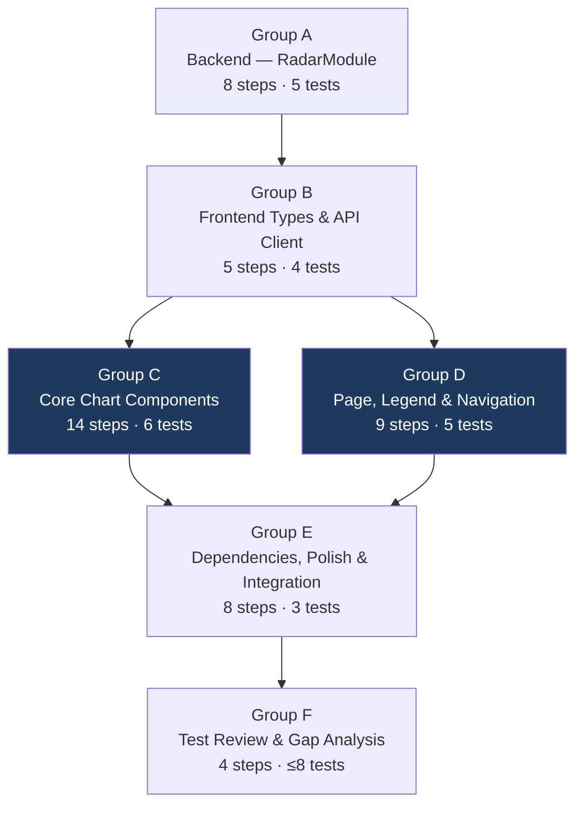

# Implementation Plan: AI Tools Radar Visualization

**Issue**: #9  
**Date**: 2026-05-26  
**Risk Level**: Medium  

---

## Overview

| Metric | Value |
|--------|-------|
| Task Groups | 6 |
| Total Steps | ~46 |
| Expected Tests | 22–36 (across all groups) |
| Has Testing Group | Yes (Group F) |
| Estimated Effort | 12–17 hours |

---

## Execution Diagram

Task-group dependency flow — C and D can be parallelized after B completes.

> **Parallelism**: Groups C and D share only the Group B prerequisite and are otherwise independent — they can be developed simultaneously.

---

## Implementation Steps

---

### Task Group A: Backend — RadarModule

**Dependencies:** None  
**Estimated Steps:** 8  

- [x] A.0 Complete backend layer
  - [x] A.1 Write 5 focused tests for `RadarService` and `RadarController`
  - [x] A.2 Create `src/backend/src/radar/dto/radar-response.dto.ts`
  - [x] A.3 Create `src/backend/src/radar/radar.service.ts`
  - [x] A.4 Create `src/backend/src/radar/radar.controller.ts`
  - [x] A.5 Create `src/backend/src/radar/radar.module.ts`
  - [x] A.6 Register `RadarModule` in `src/backend/src/app.module.ts`
  - [x] A.7 Create `src/backend/src/radar/radar.service.spec.ts` and `radar.controller.spec.ts`
  - [x] A.8 Ensure backend tests pass

**Acceptance Criteria:**
- All 5 backend tests pass
- `GET /api/radar` returns valid `RadarResponseDto` wrapped in response envelope
- 4 rings, 4 quadrants, 12–20 tool points with coordinates within `[-100, 100]`

---

### Task Group B: Frontend Types & API Client

**Dependencies:** Group A  
**Estimated Steps:** 5  

- [x] B.0 Complete types and API client layer
  - [x] B.1 Write 4 focused tests for type shapes and API client method
  - [x] B.2 Create `src/frontend/src/types/radar.ts`
  - [x] B.3 Extend `src/frontend/src/lib/api.ts` with `radar` namespace
  - [x] B.4 Create `src/frontend/src/types/radar.test.ts` (or `__tests__/radar.test.ts`)
  - [x] B.5 Ensure type and API tests pass

**Acceptance Criteria:**
- All 4 type/API tests pass
- `radar.ts` exports all 6 types matching the backend DTO
- `api.radar.get()` is callable and resolves to `RadarData`

---

### Task Group C: Core Chart Components

**Dependencies:** Group B  
**Estimated Steps:** 14  

- [x] C.0 Complete core chart component layer
  - [x] C.1 Write 6 focused tests for chart sub-components
  - [x] C.2 Create `src/frontend/src/components/radar/RadarRings.tsx`
  - [x] C.3 Create `src/frontend/src/components/radar/RadarQuadrants.tsx`
  - [x] C.4 Create `src/frontend/src/components/radar/RadarBeam.tsx`
  - [x] C.5 Create `src/frontend/src/components/radar/RadarTooltip.tsx`
  - [x] C.6 Create `src/frontend/src/components/radar/RadarPoints.tsx`
  - [x] C.7 Create `src/frontend/src/components/radar/RadarChart.tsx`
  - [x] C.8 Create test files for C.1 tests
  - [x] C.9 Ensure chart component tests pass

**Acceptance Criteria:**
- All 6 chart component tests pass
- `RadarChart` renders without crashing with fixture data
- Beam has `pointer-events: none`; tool click fires `onToolClick` with correct ID
- `RadarTooltip` shows correct content when active

---

### Task Group D: Page, Legend & Navigation

**Dependencies:** Group B (types + API), Group C (chart components)  
**Estimated Steps:** 9  

- [x] D.0 Complete page, legend, and navigation layer
  - [x] D.1 Write 5 focused tests for RadarPage, RadarLegend, and navigation
  - [x] D.2 Create `src/frontend/src/components/radar/RadarLegend.tsx`
  - [x] D.3 Create `src/frontend/src/routes/RadarPage.tsx`
  - [x] D.4 Add `/radar` route to `src/frontend/src/App.tsx`
  - [x] D.5 Add "Radar" nav item to `src/frontend/src/components/layout/SidebarNav.tsx`
  - [x] D.6 Create test files for D.1 tests
  - [x] D.7 Verify navigation integration manually
  - [x] D.8 Ensure page and legend tests pass

**Acceptance Criteria:**
- All 5 page/legend/navigation tests pass
- `RadarPage` renders full loading → loaded state cycle
- `/radar` route is reachable from sidebar navigation
- `RadarLegend` shows 4 rings in correct order with colors and descriptions

---

### Task Group E: Dependencies, Polish & Integration

**Dependencies:** Groups C and D  
**Estimated Steps:** 8  

- [x] E.0 Complete integration and polish layer
  - [x] E.1 Write 3 focused integration tests
  - [x] E.2 Install frontend dependencies
  - [x] E.3 Validate animation correctness
  - [x] E.4 Validate responsive layout
  - [x] E.5 Validate styling compliance
  - [x] E.6 Validate data contract end-to-end
  - [x] E.7 Run build and type-check
  - [x] E.8 Ensure integration tests pass

**Acceptance Criteria:**
- All 3 integration tests pass
- Both frontend and backend build cleanly with zero TypeScript errors
- End-to-end data flow works: `/api/radar` → chart renders → hover → tooltip → click → `/catalog/:id`
- Responsive layout verified across 3 breakpoints
- Beam animates continuously independent of interactions

---

### Task Group F: Test Review & Gap Analysis

**Dependencies:** All previous groups (A, B, C, D, E)  
**Estimated Steps:** 4  

- [x] F.0 Review and fill critical testing gaps
  - [x] F.1 Review tests from all previous groups (27 tests verified)
  - [x] F.2 Analyse gaps in critical paths not covered
  - [x] F.3 Write 5 additional strategic tests covering identified gaps
    - RadarPage error state (Error instance + non-Error fallback)
    - RadarPage empty state (tools:[])
    - RadarService per-tool coordinate bounds (each tool within ring.radius ± 8)
    - RadarLegend Sheet trigger button presence
    - RadarChart memoization — skipped per spec guidance
  - [x] F.4 Run all feature-specific tests — 24 frontend + 26 backend = 50 total, all pass

**Acceptance Criteria:**
- All radar feature tests pass (~23–31 total)
- No regressions introduced in unrelated tests
- No more than 8 additional tests added in this group
- Error and empty states are covered

---

## Execution Order

| Step | Group | Estimated Steps | Depends On |
|------|-------|-----------------|------------|
| 1 | A: Backend — RadarModule | 8 | None |
| 2 | B: Frontend Types & API Client | 5 | Group A |
| 3 | C: Core Chart Components | 14 | Group B |
| 4 | D: Page, Legend & Navigation | 9 | Groups B + C |
| 5 | E: Dependencies, Polish & Integration | 8 | Groups C + D |
| 6 | F: Test Review & Gap Analysis | 4 | All groups |

> **Note on parallelism**: Groups C and D can proceed in parallel after Group B, since C (chart sub-components) and D (page shell + navigation wiring) have no inter-dependency. An implementer may begin D.2 (RadarLegend) and D.4–D.5 (routing + nav) while working on C.2–C.6 (chart components), merging in C.7 (RadarChart assembly) as the final step before Group E.

---

## File Inventory

### New Files (15 total)

| File | Group |
|------|-------|
| `src/backend/src/radar/dto/radar-response.dto.ts` | A |
| `src/backend/src/radar/radar.service.ts` | A |
| `src/backend/src/radar/radar.service.spec.ts` | A |
| `src/backend/src/radar/radar.controller.ts` | A |
| `src/backend/src/radar/radar.controller.spec.ts` | A |
| `src/backend/src/radar/radar.module.ts` | A |
| `src/frontend/src/types/radar.ts` | B |
| `src/frontend/src/types/radar.test.ts` | B |
| `src/frontend/src/components/radar/RadarRings.tsx` | C |
| `src/frontend/src/components/radar/RadarQuadrants.tsx` | C |
| `src/frontend/src/components/radar/RadarBeam.tsx` | C |
| `src/frontend/src/components/radar/RadarPoints.tsx` | C |
| `src/frontend/src/components/radar/RadarTooltip.tsx` | C |
| `src/frontend/src/components/radar/RadarChart.tsx` | C |
| `src/frontend/src/components/radar/__tests__/RadarRings.test.tsx` | C |
| `src/frontend/src/components/radar/__tests__/RadarPoints.test.tsx` | C |
| `src/frontend/src/components/radar/__tests__/RadarTooltip.test.tsx` | C |
| `src/frontend/src/components/radar/RadarLegend.tsx` | D |
| `src/frontend/src/components/radar/__tests__/RadarLegend.test.tsx` | D |
| `src/frontend/src/routes/RadarPage.tsx` | D |
| `src/frontend/src/routes/__tests__/RadarPage.test.tsx` | D |

### Modified Files (4 total)

| File | Change | Group |
|------|--------|-------|
| `src/backend/src/app.module.ts` | Import + register `RadarModule` | A |
| `src/frontend/src/lib/api.ts` | Add `radar: { get: ... }` namespace | B |
| `src/frontend/src/App.tsx` | Add `/radar` route nested under `MainLayout` | D |
| `src/frontend/src/components/layout/SidebarNav.tsx` | Add "Radar" to `NAV_ITEMS` | D |

---

## Reusable Components Reference

| Existing Code | Location | How to Leverage |
|---|---|---|
| Page data-fetch pattern | `CatalogPage.tsx` | Copy `useState` + `useEffect` + loading/error/empty render verbatim |
| Glassmorphic card styles | `ToolCard.tsx` | Reuse `bg-card/30 backdrop-blur-sm border border-primary/20 rounded-[var(--radius)]` |
| Framer Motion entrance | `ToolCard.tsx` | Reuse `motion.div initial={{ opacity: 0, y: 20 }} animate={{ opacity: 1, y: 0 }}` |
| Nav item pattern | `SidebarNav.tsx` | Extend `NAV_ITEMS` array only — no new component needed |
| API client wrapper | `api.ts` | Extend `api` object using existing `request<T>` wrapper |
| NestJS module structure | `tools.module.ts` | Copy module-controller-service structure exactly |
| `shadcn Sheet` | `@/components/ui/sheet` | Use for mobile legend drawer (install if missing) |

---

## Standards Compliance

Follow active standards from `.flowbit/docs/standards/`:

### `global/coding-standards.md`
- TypeScript strict mode enabled — all types must be explicit (no `any`)
- Functional components only; `React.memo` on performance-critical components
- Use `const` assertions and readonly types where applicable

### `frontend/frontend-standards.md`
- shadcn/ui first: check shadcn before creating custom components (specifically use `Sheet` for drawer, not a custom one)
- PascalCase filenames for all component files
- Colocate test files alongside or in `__tests__/` subdirectory of component
- Tailwind CSS + CSS variables for all color values — no hardcoded hex in Tailwind class strings
- Framer Motion for entrance animations and interactive state transitions

### `backend/backend-standards.md`
- NestJS module-per-feature pattern (enforced: one directory per domain under `src/backend/src/`)
- `@Injectable()` on all services; constructor injection only
- No `class-validator` on read-only GET endpoints with no request body
- Co-locate `*.spec.ts` test files next to source files under `src/`

### `testing/testing-standards.md`
- Backend tests: Jest, `*.spec.ts`, colocated with source, ≥80% line coverage for services
- Frontend tests: Vitest + React Testing Library, `*.test.tsx`, colocated or `__tests__/`
- Test behaviour, not implementation — test public interface outputs, not internal state
- Mock `fetch`/API at module boundary (not inside component)
- Reset mocks between tests using `vi.resetAllMocks()` or `clearMocks: true` in config

---

## Notes

- **Test-Driven**: Every group starts with 2–8 targeted tests before implementation begins
- **Run Incrementally**: Only run new group tests after each group — do NOT run full test suite mid-feature
- **Run Full Suite Once**: After Group F, run the full suite once to check for regressions
- **Mark Progress**: Check off steps as completed; markdown checkboxes are the resume point if implementation is interrupted
- **Reuse First**: Always prefer existing patterns (CatalogPage fetch, ToolCard styles, tools.module.ts structure) over inventing new patterns
- **Closure Pattern**: The `onToolClick` callback in `RadarChart` → `RadarPoints` MUST use the closure pattern (`shape={(props) => <RadarPoints {...props} onToolClick={onToolClick} />}`) because Recharts only injects its own props into shape renderers
- **SVG Coordinate System**: All SVG overlays reference the same Recharts scale functions for pixel-accurate alignment; always extract scale from `xAxisMap[0].scale` and `yAxisMap[0].scale`
- **Dependencies First in Group E**: Install `recharts` and shadcn `sheet` before attempting the build validation step

---

*Generated from: `implementation/spec.md`, `analysis/gap-analysis.md`, `analysis/technical-clarifications.md`*
