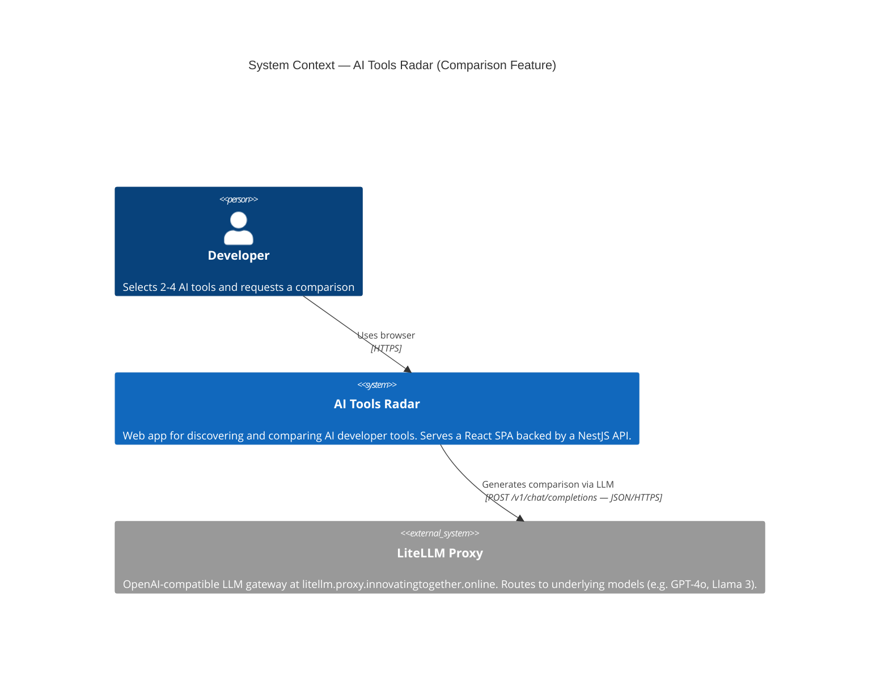
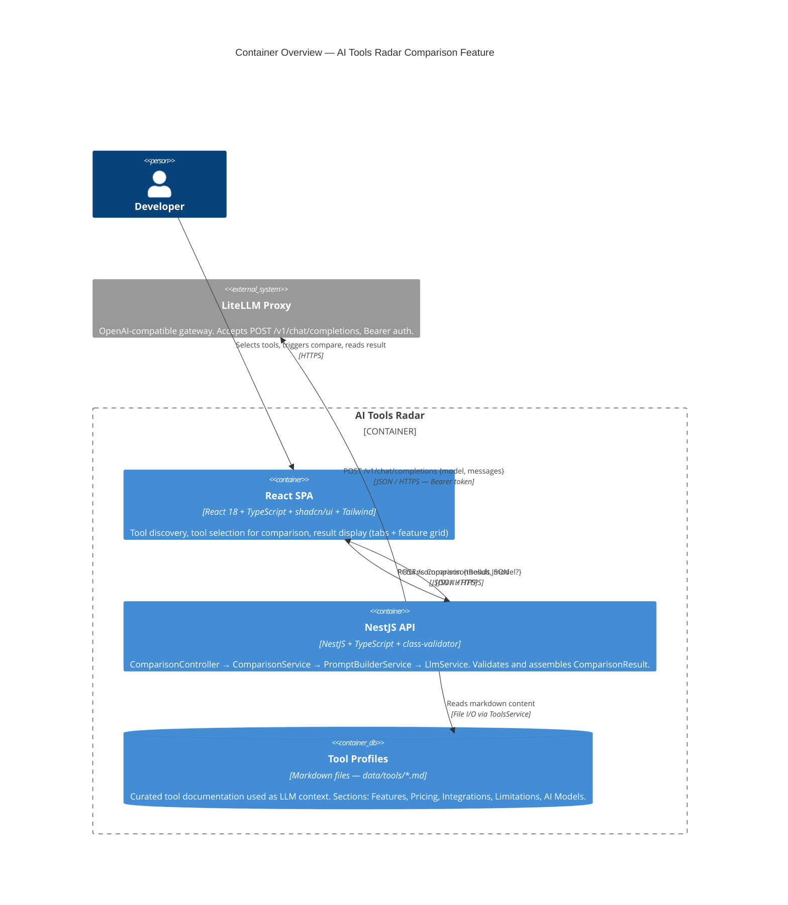
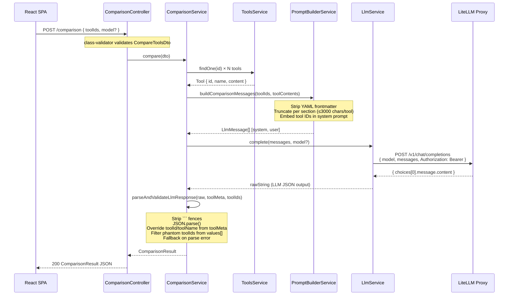

# High-Level Design: AI Tool Comparison Feature

## Design Overview

The AI Tools Radar "Start Comparing" feature lets developers select 2–4 AI tools from the radar and receive a structured, side-by-side comparison generated by an LLM. The feature addresses the core need to move beyond simple tool listings to opinionated, evidence-based comparisons grounded in curated tool documentation.

The chosen approach uses a **hybrid static+dynamic section strategy** rendered as a **tabbed feature-grid UI**. Four canonical sections (Core Features, Pricing, Integrations, Limitations) are always requested from the LLM; the LLM may add extra sections if the tool content warrants it. Each section contains a **feature-level comparison table** where rows are named features and cells show a boolean availability indicator (✓/✗) plus a 1-sentence description. Per-tool prose summary cards complete the result view. All structured data flows through a single `ComparisonResult` JSON contract produced by the LLM and validated server-side before reaching the frontend.

**Key decisions:**
- **Text over scores** — numeric scores were rejected in favour of `available: boolean` + `description: string` per feature cell; this avoids false precision and communicates nuance
- **Server-controlled identity fields** — `toolId`, `toolName`, and `generatedAt` are always set by the NestJS layer, never trusted from the LLM, preventing prompt-injection attacks
- **Outlet context for model propagation** — `selectedModel` state is lifted to `MainLayout` and shared via React Router v6 `<Outlet context>`, avoiding a full React Context provider for a single value
- **Hybrid section strategy** — 4 static section IDs are enumerated in the prompt; LLM may add extras, but the frontend renders whatever `sections[]` array is returned, so static and dynamic sections are uniform in shape
- **Hybrid granularity** — feature-table rows plus a `summary` string per section provide both machine-scannable grid data and human-readable narrative

---

## Architecture

### System Context (C4 Level 1)



**Description**: The developer interacts with the React SPA. When a comparison is triggered, the NestJS backend fetches local tool markdown files, constructs a prompt, and calls the LiteLLM Proxy. No tool profile data leaves the internal system to any destination other than the LiteLLM Proxy.

---

### Container Overview (C4 Level 2)



**Description**: The SPA sends a `POST /comparison` request carrying tool IDs and the user's chosen LiteLLM model. The NestJS API reads tool markdown via `ToolsService`, builds a structured prompt via `PromptBuilderService`, and calls `LlmService` which forwards to LiteLLM. The raw LLM response is validated and mapped to `ComparisonResult` before being returned to the SPA.

---

## Key Components

| Component | Purpose | Responsibilities | Key Interfaces | Dependencies |
|-----------|---------|-----------------|----------------|-------------|
| **ComparisonController** | HTTP entry point | Accept `POST /comparison`; validate DTO; delegate to service; return result | `compare(dto: CompareToolsDto): Promise<ComparisonResult>` | `ComparisonService` |
| **ComparisonService** | Orchestrator | Fetch tool metadata; build prompt; call LLM; parse + validate response; return `ComparisonResult` | `compare(dto): Promise<ComparisonResult>`; `parseAndValidateLlmResponse()`; `buildFallback()` | `ToolsService`, `PromptBuilderService`, `LlmService` |
| **PromptBuilderService** | Prompt factory | Produce `[system, user]` message array from tool IDs and tool content; strip YAML frontmatter; truncate per section | `buildComparisonMessages(toolIds, toolContents): LlmMessage[]` | `ToolsService` (indirectly, content passed in) |
| **LlmService** | LLM client | Send chat completion request to LiteLLM; handle mock mode; extract `choices[0].message.content` | `complete(messages, model?): Promise<string>` | Axios, `AppConfig` |
| **ToolsService** | Profile reader | Load tool markdown from `data/tools/`; provide tool metadata (id, name) | `findOne(id): Tool`; `findAll(): Tool[]` | File system / static data |
| **MainLayout (React)** | App shell + state owner | Own `selectedModel` state; fetch available models; pass via `<Outlet context>`; render `Sidebar` as controlled component | `useModels()` hook; `<Outlet context={{ selectedModel, onModelChange }}>` | `Sidebar`, `useModels`, React Router |
| **Sidebar (React)** | Model selector UI | Render model dropdown; become fully controlled (no internal state) | Props: `selectedModel`, `onModelChange`, `models`, `loading` | `MainLayout` (parent) |
| **ToolsPage (React)** | Comparison trigger | Read `selectedModel` from outlet context; collect selected tool IDs; call `api.comparison.compare()`; navigate to result | `useOutletContext<{ selectedModel }>()` | `api.comparison`, React Router `useNavigate` |
| **ComparisonResultView (React)** | Result renderer | Render recommendation callout, tool summary cards, tabbed section grid, feature rows with ✓/✗ cells | Props: `result: ComparisonResult` | shadcn/ui `Tabs`, `Card`, `Badge` |
| **FeatureTable (React)** | Section feature grid | Render feature rows as a responsive table; one column per tool; boolean → icon + description | Props: `section: ComparisonSection`, `toolIds: string[]` | shadcn/ui `Table` |
| **ToolSummaryCard (React)** | Per-tool prose card | Display `bestFor`, `notIdealFor`, `keyDifferentiators` | Props: `summary: ToolSummary` | shadcn/ui `Card` |

---

## TypeScript Interfaces

> These interfaces are **identical in shape** for frontend and backend. Backend uses semicolons (TypeScript class style); frontend uses no semicolons. JSDoc comments shown on the frontend version.

### Frontend — `src/frontend/src/types/comparison.ts`

```typescript
/**
 * Request payload sent from ToolsPage to POST /comparison.
 */
export interface ComparisonRequest {
  /** IDs of the tools to compare (2–4). */
  toolIds: string[]
  /** Optional LiteLLM model name selected by the user in the Sidebar. */
  model?: string
}

/**
 * A single tool's availability and implementation detail for one feature.
 * One entry per compared tool, ordered to match ComparisonResult.tools[].
 */
export interface FeatureValue {
  /** Tool identifier — always server-controlled, never from LLM output. */
  toolId: string
  /** Whether this tool supports / offers the feature. Drives ✓ or ✗ icon. */
  available: boolean
  /** One-sentence description of how the tool implements this feature,
   *  or "Not supported" when available=false. */
  description: string
}

/**
 * A single row in a feature comparison table.
 */
export interface FeatureRow {
  /** Short feature name displayed as the row label, e.g. "MCP support", "Free tier". */
  name: string
  /** Optional one-sentence explanation of what this feature means. */
  description?: string
  /** One FeatureValue per compared tool, in the same order as ComparisonResult.tools[]. */
  values: FeatureValue[]
}

/**
 * One tab in the comparison result view (e.g. "Core Features", "Pricing").
 * The LLM always produces the 4 static sections; it may append additional ones.
 */
export interface ComparisonSection {
  /** Machine identifier for the section. Static: "features" | "pricing" | "integrations" | "limitations".
   *  Dynamic sections added by LLM use their own slug. */
  id: string
  /** Human-readable tab label, e.g. "Core Features". */
  title: string
  /** Optional 2–4 sentence narrative summary of this section across all tools. */
  summary?: string
  /** Feature rows forming the comparison grid for this section. */
  features: FeatureRow[]
}

/**
 * Prose summary card for a single compared tool.
 * Rendered as a card below the recommendation banner.
 */
export interface ToolSummary {
  /** Tool identifier — always server-controlled. */
  toolId: string
  /** Tool display name — always server-controlled. */
  toolName: string
  /** 1–2 sentences describing the ideal use case or user for this tool. */
  bestFor: string
  /** 1–2 sentences describing when to avoid this tool. */
  notIdealFor: string
  /** 2–4 short phrases highlighting what makes this tool unique. */
  keyDifferentiators: string[]
}

/**
 * The full comparison result returned by POST /comparison and rendered
 * by ComparisonResultView. Tools array and server-controlled fields
 * are always set by the NestJS layer, never by the LLM.
 */
export interface ComparisonResult {
  /** Ordered list of toolIds that were compared — server-controlled. */
  tools: string[]
  /** 2–4 sentence overview of the comparison. */
  summary: string
  /** Prose recommendation covering which tool fits which scenario. */
  recommendation: string
  /** ISO 8601 timestamp of when this comparison was generated — server-controlled. */
  generatedAt: string
  /** Per-tool prose summary cards. One entry per tool in tools[]. */
  toolSummaries: ToolSummary[]
  /** Tab sections containing feature comparison grids. */
  sections: ComparisonSection[]
}
```

### Backend — `src/backend/src/comparison/comparison.service.ts` (interface block)

```typescript
/** A single tool's availability and implementation detail for one feature row. */
export interface FeatureValue {
  toolId: string;       // server-controlled — overridden from toolMeta, never trusted from LLM
  available: boolean;   // true = supports feature; false = does not
  description: string;  // one sentence; "Not supported" when available=false
}

/** One row in a section's feature comparison grid. */
export interface FeatureRow {
  name: string;          // short feature name, e.g. "MCP support"
  description?: string;  // optional: what this feature means in 1 sentence
  values: FeatureValue[];
}

/** One tab in the comparison result view. */
export interface ComparisonSection {
  id: string;            // "features" | "pricing" | "integrations" | "limitations" | dynamic slug
  title: string;         // human-readable tab label
  summary?: string;      // optional narrative summary for this section
  features: FeatureRow[];
}

/** Per-tool prose summary card. */
export interface ToolSummary {
  toolId: string;                  // server-controlled
  toolName: string;                // server-controlled
  bestFor: string;                 // ideal use case (1-2 sentences)
  notIdealFor: string;             // when to avoid (1-2 sentences)
  keyDifferentiators: string[];    // 2-4 unique value bullets
}

/** Full comparison result contract. */
export interface ComparisonResult {
  tools: string[];                  // toolIds — server-controlled
  summary: string;                  // 2-4 sentence overview
  recommendation: string;           // which tool for which scenario
  generatedAt: string;              // ISO 8601 — server-controlled
  toolSummaries: ToolSummary[];
  sections: ComparisonSection[];
}
```

---

## LLM Prompt Design

### System Message Template

```
You are an AI developer tool comparison expert. Your job is to compare tools based on their documentation.

You MUST respond with ONLY a valid JSON object. No prose, no markdown, no explanation outside the JSON fences.
Your entire response must be parseable by JSON.parse().

## OUTPUT SCHEMA

{
  "summary": string,              // 2-4 sentence overview comparing the tools at a high level
  "recommendation": string,       // 2-4 sentences: which tool for which use case / user profile
  "toolSummaries": [
    {
      "toolId": string,           // MUST be one of: ${toolIds.join(' | ')}
      "bestFor": string,          // 1-2 sentences: the ideal user or scenario
      "notIdealFor": string,      // 1-2 sentences: when you would avoid this tool
      "keyDifferentiators": [     // 2-4 short phrases (not full sentences) of unique value
        string
      ]
    }
  ],
  "sections": [
    {
      "id": string,               // one of: "features" | "pricing" | "integrations" | "limitations" | custom slug
      "title": string,            // human-readable tab label, e.g. "Core Features"
      "summary": string,          // 2-3 sentences summarising this section across all tools
      "features": [
        {
          "name": string,         // short feature name, e.g. "MCP support", "Free tier", "SSO"
          "description": string,  // one sentence: what this feature means or why it matters
          "values": [
            {
              "toolId": string,       // MUST be one of: ${toolIds.join(' | ')}
              "available": boolean,   // true = tool supports/offers this; false = does not
              "description": string   // how the tool implements this (1 sentence), or "Not supported"
            }
          ]
        }
      ]
    }
  ]
}

## RULES

1. toolSummaries[] MUST have exactly one entry per toolId: ${toolIds.join(', ')}
2. Every features[].values[] MUST have exactly one entry per toolId: ${toolIds.join(', ')}
3. Do NOT use numeric scores, ratings, or rankings anywhere.
4. Use available=false + description="Not supported" when a tool lacks a feature.
5. Include the 4 base sections: "features", "pricing", "integrations", "limitations".
   If the documentation provides strong evidence for an additional meaningful section (e.g. "security", "performance"), you may add it AFTER the 4 base sections. Maximum 7 sections total.
6. Include 5-10 feature rows per section. Choose the most meaningful comparison points from the documentation.
7. Feature descriptions (values[].description) must be ≤ 2 sentences. Do not exceed this.
8. toolSummaries[].keyDifferentiators: 2-4 items, each ≤ 10 words. Short phrases only.
9. toolId values in your response MUST exactly match: ${toolIds.join(', ')}
   The server will override toolId/toolName fields in toolSummaries — you may omit toolName from toolSummaries.

IMPORTANT: Do not invent tool capabilities not present in the documentation provided.
```

### User Message Template

```
Compare these ${toolIds.length} AI developer tools:

${tools.map(t => `
---
### ${t.name} (toolId: ${t.id})

${extractedContent(t)}
`).join('\n')}

---
Focus your comparison on: Core Features, Pricing, Integrations, Limitations.
Be specific and evidence-based. If a feature is not documented, mark available=false.
```

### Prompt Token Budget

| Segment | Approximate Size | Strategy |
|---------|-----------------|---------|
| System message | ~600 tokens | Fixed — defined above |
| User message header | ~30 tokens | Fixed |
| Per-tool content (×n tools) | ≤3,000 chars / tool | Truncate at 3,000 chars after frontmatter strip; split across 4 sections evenly (≤750 chars/section) |
| Total (2 tools) | ~1,800 tokens | Well within 4k context minimum |
| Total (4 tools) | ~3,200 tokens | Leaves ample room for 4k+ models |
| LLM response budget | ~2,000-3,000 tokens | 5 sections × 8 rows × 2 tools × ~40 token/cell |

---

## Backend Architecture

### Request Data Flow



### Module Wiring Fix — `comparison.module.ts`

```typescript
import { Module } from '@nestjs/common';
import { ToolsModule } from '../tools/tools.module';
import { LlmModule } from '../llm/llm.module';              // ← ADD: provides LlmService
import { ComparisonController } from './comparison.controller';
import { ComparisonService } from './comparison.service';
import { PromptBuilderService } from './prompt.builder';    // ← ADD: used by ComparisonService

@Module({
  imports: [ToolsModule, LlmModule],                        // ← ADD LlmModule
  controllers: [ComparisonController],
  providers: [ComparisonService, PromptBuilderService],     // ← ADD PromptBuilderService
})
export class ComparisonModule {}
```

**Why**: `ComparisonService` constructor injects `LlmService` (requires `LlmModule` in imports) and `PromptBuilderService` (requires it listed in providers). Without these 2 entries, NestJS DI throws at startup.

---

## Frontend Architecture

### Component Tree & State Flow

```
MainLayout (owns selectedModel state)
├─ state: selectedModel: string
├─ state: models: Model[]
├─ state: modelsLoading: boolean
├─ useEffect → GET /llm/models → sets models[]
│
├─ <Sidebar
│    selectedModel={selectedModel}
│    onModelChange={setSelectedModel}     ← controlled component
│    models={models}
│    loading={modelsLoading}
│  />
│
└─ <Outlet context={{ selectedModel }} /> ← threads state to child routes
     │
     ├─ <ToolsPage>
     │    const { selectedModel } = useOutletContext()
     │    handleCompare(toolIds) →
     │      api.comparison.compare({ toolIds, model: selectedModel || undefined })
     │      → navigate('/comparison/result', { state: { result } })
     │
     └─ <ComparisonResultPage>
          reads location.state.result: ComparisonResult
          │
          └─ <ComparisonResultView result={result}>
               ├─ <RecommendationCallout>    ← result.recommendation
               ├─ <p>{result.summary}</p>
               ├─ <ToolSummaryCards>
               │    result.toolSummaries.map(s =>
               │      <ToolSummaryCard summary={s} />)
               │
               └─ <Tabs defaultValue={sections[0].id}>
                    result.sections.map(section =>
                      <TabsTrigger value={section.id}>{section.title}</TabsTrigger>
                      <TabsContent value={section.id}>
                        <p>{section.summary}</p>
                        <FeatureTable
                          section={section}
                          toolIds={result.tools}
                        />
                      </TabsContent>
                    )
```

### `FeatureTable` Cell Rendering

```
FeatureTable
  <Table>
    <TableHeader>
      <th>Feature</th>
      <th>{toolName}</th> × N tools
    </TableHeader>
    <TableBody>
      section.features.map(row =>
        <TableRow>
          <TableCell>
            <span>{row.name}</span>
            {row.description && <p className="text-muted-foreground text-xs">{row.description}</p>}
          </TableCell>
          {row.values.map(v =>
            <TableCell>
              {v.available
                ? <CheckCircle className="text-green-500" />
                : <XCircle className="text-muted-foreground" />}
              <p className="text-xs mt-1">{v.description}</p>
            </TableCell>
          )}
        </TableRow>
      )
    </TableBody>
  </Table>
```

---

## Prompt Content Strategy

### What to Extract from Tool Markdown Files

Tool profiles in `data/tools/*.md` have YAML frontmatter followed by markdown sections. The `PromptBuilderService` already strips frontmatter. Content extraction strategy:

| Step | Action | Limit |
|------|--------|-------|
| 1 | Strip YAML frontmatter (`---…---` block) | Already implemented |
| 2 | Locate the 4 relevant H2 sections: `## Features`, `## Pricing`, `## Integrations`, `## Limitations` | Regex or string split on `\n## ` |
| 3 | Extract content under each heading up to the next `##` | Per-section content |
| 4 | Truncate each section to **750 characters** | Keeps per-tool total ≤ 3,000 chars |
| 5 | If a section is absent from the file, include the full content up to 3,000 chars | Fallback: use full content |
| 6 | Also include `## AI Models` section if present (≤ 500 chars extra) | Extra context for LLM model comparisons |

### Truncation Logic

```typescript
private extractRelevantContent(rawMarkdown: string): string {
  // 1. Strip YAML frontmatter
  const stripped = rawMarkdown.replace(/^---[\s\S]*?---\n/, '');

  // 2. Split into sections by ## headers
  const sectionMap = new Map<string, string>();
  const parts = stripped.split(/\n(?=## )/);
  for (const part of parts) {
    const match = part.match(/^## (.+)/);
    if (match) {
      sectionMap.set(match[1].trim().toLowerCase(), part.slice(match[0].length).trim());
    }
  }

  // 3. Extract priority sections with per-section char limit
  const targets = ['features', 'pricing', 'integrations', 'limitations', 'ai models'];
  const perSectionLimit = 750;
  const chunks: string[] = [];
  for (const target of targets) {
    const content = sectionMap.get(target);
    if (content) {
      chunks.push(`## ${target.charAt(0).toUpperCase() + target.slice(1)}\n${content.slice(0, perSectionLimit)}`);
    }
  }

  // 4. Fallback: if no sections found, return first 3000 chars of stripped content
  if (chunks.length === 0) return stripped.slice(0, 3000);

  return chunks.join('\n\n');
}
```

---

## Integration Points

| Integration | Direction | Protocol | Auth | Notes |
|-------------|-----------|----------|------|-------|
| SPA → NestJS API | Outbound from SPA | `POST /comparison` — JSON/HTTPS | None (internal) | `VITE_API_BASE_URL` configures base URL |
| NestJS → LiteLLM Proxy | Outbound from backend | `POST /v1/chat/completions` — JSON/HTTPS | `Authorization: Bearer <OLLAMA_API_KEY>` | Activated by `LLM_MODE=ollama` in `.env` |
| NestJS → Tool Profiles | Internal read | File I/O via `ToolsService` | N/A — static files | Markdown at `data/tools/*.md` |
| NestJS → LLM Models list | Outbound | `GET /v1/models` | Same Bearer token | Used by `useModels` hook to populate Sidebar dropdown |
| Frontend router → Result page | Internal navigation | React Router `useNavigate` | N/A | Result passed via `location.state.result` |

---

## Design Decisions

See [decision-log.md](./decision-log.md) for full MADR-format ADRs.

| ADR | Decision | Status |
|-----|----------|--------|
| [ADR-001](./decision-log.md#adr-001-text-based-comparison-over-numeric-scores) | Text-based `available: boolean` + `description` over numeric scores | Accepted |
| [ADR-002](./decision-log.md#adr-002-static--dynamic-section-strategy) | 4 static base sections + LLM may add extras | Accepted |
| [ADR-003](./decision-log.md#adr-003-hybrid-feature-granularity) | Feature table rows + per-section prose summary | Accepted |
| [ADR-004](./decision-log.md#adr-004-selectedmodel-propagation-via-react-router-outlet-context) | React Router `<Outlet context>` over React Context provider | Accepted |

---

## Concrete Examples

### Example 1 — Two-tool comparison (GitHub Copilot vs Cursor)

**Given**: User selects "github-copilot" and "cursor" on the Tools page, chooses model "gpt-4o" in Sidebar, clicks "Start Comparing"

**When**: `POST /comparison { toolIds: ["github-copilot", "cursor"], model: "gpt-4o" }` is sent

**Then**:
- `ComparisonResult.tools` = `["github-copilot", "cursor"]` (server-controlled)
- `ComparisonResult.sections` contains at minimum 4 tabs: Core Features, Pricing, Integrations, Limitations
- Each tab's feature table has 1 column for each tool
- The "MCP support" row in Core Features shows `available: false` for GitHub Copilot and `available: true` for Cursor with a 1-sentence description
- `toolSummaries[0]` card for GitHub Copilot shows `bestFor: "Enterprise teams already in the GitHub ecosystem …"` and `keyDifferentiators: ["Deep IDE integration via extensions", "GitHub Actions workflow awareness"]`
- `generatedAt` is the current ISO timestamp, not a value from the LLM

### Example 2 — LLM parse failure fallback

**Given**: LiteLLM returns malformed JSON (e.g. truncated response due to token limit)

**When**: `JSON.parse(cleanedResponse)` throws in `parseAndValidateLlmResponse()`

**Then**:
- `buildFallback()` is called with the raw text
- `ComparisonResult.summary` contains the first 500 characters of raw LLM output
- `ComparisonResult.sections` = `[]`
- `ComparisonResult.toolSummaries` contains properly server-controlled entries with empty text fields
- Frontend renders the summary text and empty tabs gracefully (empty state in `FeatureTable`)
- `generatedAt` is set by the server, not from the LLM

### Example 3 — Four-tool comparison with dynamic section

**Given**: User compares four tools whose docs all contain detailed security information

**When**: LLM response includes a fifth section `{ id: "security", title: "Security & Compliance", features: [...] }`

**Then**:
- `ComparisonResult.sections` has 5 entries (4 static + 1 dynamic)
- Frontend renders 5 tabs — the "Security & Compliance" tab appears after the 4 base tabs
- No frontend code change is required; `sections.map(…)` handles any number of sections generically
- Each security feature row has one `FeatureValue` per tool with `available` and `description` populated

---

## Out of Scope

The following are explicitly NOT addressed by this design:

- **Comparison history / persistence** — comparisons are ephemeral; not stored in any database. Each compare request re-calls the LLM. Caching or saving results is deferred.
- **Side-by-side view mode** — the tabbed grid is the only layout. A horizontal scroll or split-panel view is deferred.
- **User accounts / authentication** — the app is publicly accessible; no auth layer is in scope.
- **Comparison sharing / URLs** — result pages are not bookmarkable (state passed via `location.state`). Shareable comparison URLs are deferred.
- **LLM provider selection beyond LiteLLM** — the backend supports any OpenAI-compatible endpoint, but UI for switching providers is out of scope.
- **Real-time streaming of LLM output** — the comparison waits for the full JSON response before rendering. Streaming with partial rendering is deferred.
- **Tool profile editing UI** — tool markdown files are edited directly in `data/tools/`. No CMS or editor UI.
- **Comparison of more than 4 tools** — `CompareToolsDto` enforces `@ArrayMaxSize(4)`. Larger comparisons are deferred.
- **ADR-level decisions** on test strategy, CI integration, or deployment — those are implementation concerns, not architecture concerns.

---

## Success Criteria

1. **End-to-end flow completes** — a `POST /comparison` with 2 valid tool IDs returns a `ComparisonResult` with `sections.length >= 4` and `toolSummaries.length == 2` within 30 seconds
2. **Security invariant holds** — `toolId` and `toolName` in `toolSummaries[]` always match the server-side `toolMeta` values, regardless of what the LLM returns
3. **LLM parse robustness** — when the LLM returns malformed JSON, `buildFallback()` produces a valid `ComparisonResult` (not an HTTP 500)
4. **Model selection propagates** — changing the model in the Sidebar dropdown causes the next comparison request to include `model: <selected>` in the POST body
5. **Feature grid renders correctly** — a `ComparisonSection` with 8 feature rows and 2 tools renders a table with 8 rows × 3 columns (1 label + 2 tool columns), each cell showing ✓ or ✗ and a description string
6. **Dynamic sections render** — if the LLM returns a 5th section, the frontend renders 5 tabs without any code change
