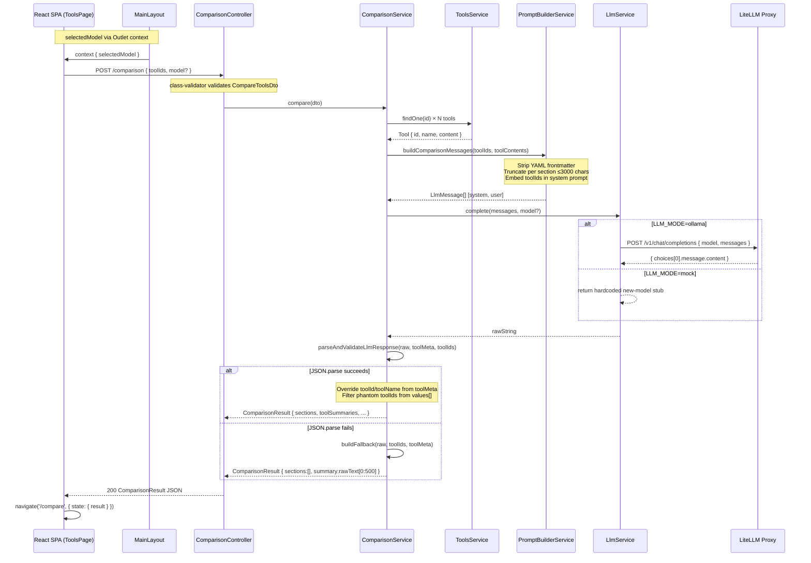
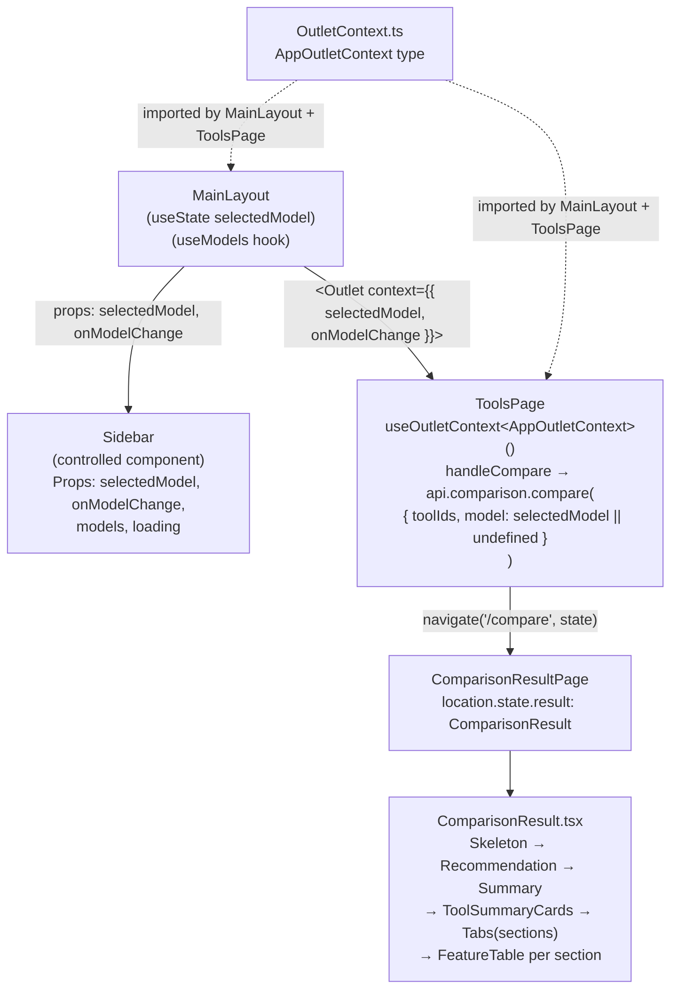

# Specification: Comparison Feature — Full End-to-End Implementation (Epics #5/#6/#7)

## Goal

Deliver a fully working AI Tools Radar comparison feature by fixing 2 critical NestJS DI bugs, replacing the rejected score-based data model with the accepted text-based `ComparisonSection/FeatureRow/FeatureValue` model end-to-end across backend and frontend, lifting `selectedModel` state to `MainLayout`, rewriting `ComparisonResult.tsx` as a tabbed feature-grid UI, and creating all missing test coverage — resulting in a working `POST /comparison` flow that renders a structured, LLM-generated tool comparison.

---

## User Stories

- As a developer, I want to select 2–4 AI tools and see a side-by-side feature comparison so that I can make an informed adoption decision without reading every tool's full documentation.
- As a developer, I want to choose which LLM model generates the comparison so that I can balance quality and latency to my preference.
- As a developer, I want to see ✓/✗ indicators per feature per tool so that I can quickly scan which tools support the capabilities I care about.
- As a developer, I want a prose recommendation alongside the feature grid so that I can understand which tool fits which scenario at a glance.
- As a developer, I want graceful degradation when the LLM produces malformed output so that the app never crashes and shows whatever information is available.

---

## Current State vs Desired State

| Dimension | Current State | Desired State |
|-----------|--------------|--------------|
| **DI wiring** | `comparison.module.ts` missing `LlmModule` import and `PromptBuilderService` in providers; app crashes on startup | `comparison.module.ts` imports `LlmModule`, registers `PromptBuilderService`; app starts cleanly |
| **Backend data model** | `ComparedTool`/`Criterion`/`score: number` interfaces (rejected by product owner) | `FeatureValue`/`FeatureRow`/`ComparisonSection`/`ToolSummary`/`ComparisonResult` interfaces (no numeric scores) |
| **LLM prompt** | System prompt describes old `comparedTools[].score`, `criteria[].ratings[].score` schema | System prompt describes new `sections[]`, `toolSummaries[]`, `FeatureRow[]`, `available: boolean` schema |
| **LLM mock** | `mockComplete()` sniffs for `"comparedTools"` string; will always return plain text after prompt rewrite, causing every mock-mode comparison to fall back | `mockComplete()` returns hardcoded new-model JSON stub unconditionally, without string-sniffing |
| **parseAndValidateLlmResponse** | Validates/maps old `comparedTools`/`criteria`/`clampScore` shapes | Validates/maps new `sections`/`toolSummaries`; server overrides `toolId`/`toolName`; filters phantom toolIds |
| **buildFallback** | Returns old-model fallback with `score: 5`, `comparedTools[]` | Returns new-model fallback: `toolSummaries[]` with empty text fields, `sections: []`, raw LLM text in `summary` |
| **Frontend types** | 9-line stub; `ComparisonResult` has only 3 fields; `ComparisonRequest` missing `model?` | 6-interface model matching the HLD contract; all fields typed |
| **selectedModel** | Trapped in `Sidebar.tsx` state; `ToolsPage` never receives it; `model` field never sent in API calls | Lifted to `MainLayout`; threaded via `<Outlet context>`; `ToolsPage` reads via `useOutletContext`; API call includes `model: selectedModel \|\| undefined` |
| **ComparisonResult.tsx** | 24-line stub rendering only `<pre>{result.summary}</pre>` | Tabbed layout: loading skeleton, back navigation, recommendation callout, summary prose, `ToolSummaryCard` per tool, `Tabs` with `FeatureTable` per section, fallback warning banner, `generatedAt` footer |
| **FeatureTable** | Does not exist | New component: shadcn/ui `Table`; header = tool names; rows = features; cells = ✓/✗ icon + description text |
| **ToolSummaryCard** | Does not exist | New component: shadcn/ui `Card`; displays `bestFor`, `notIdealFor`, `keyDifferentiators` as `Badge` chips |
| **OutletContext.ts** | Does not exist | New file: exports `AppOutletContext` interface `{ selectedModel: string; onModelChange: (m: string) => void }` |
| **Tests** | 5 failing tests; 2 missing test files | All 5 existing tests rewritten; `prompt.builder.spec.ts` created (6 tests); `llm.service.spec.ts` created (5 tests); total 21 tests passing |

---

## Complete TypeScript Interfaces

> Interfaces are **identical in shape** for frontend and backend. Backend uses semicolons; frontend uses no semicolons and includes JSDoc.

### Frontend — `src/frontend/src/types/comparison.ts` (complete file replacement)

```typescript
/**
 * Request payload sent from ToolsPage to POST /comparison.
 */
export interface ComparisonRequest {
  /** IDs of the tools to compare (2–4). */
  toolIds: string[]
  /** Optional LiteLLM model name selected by the user in the Sidebar. */
  model?: string
}

/**
 * A single tool's availability and implementation detail for one feature.
 * One entry per compared tool, ordered to match ComparisonResult.tools[].
 */
export interface FeatureValue {
  /** Tool identifier — always server-controlled, never trusted from LLM output. */
  toolId: string
  /** Whether this tool supports / offers the feature. Drives ✓ or ✗ icon. */
  available: boolean
  /** One-sentence description of how the tool implements this feature,
   *  or "Not supported" when available=false. */
  description: string
}

/**
 * A single row in a feature comparison table.
 */
export interface FeatureRow {
  /** Short feature name displayed as the row label, e.g. "MCP support", "Free tier". */
  name: string
  /** Optional one-sentence explanation of what this feature means. */
  description?: string
  /** One FeatureValue per compared tool, in the same order as ComparisonResult.tools[]. */
  values: FeatureValue[]
}

/**
 * One tab in the comparison result view.
 * Static section IDs: "features" | "pricing" | "integrations" | "limitations".
 * The LLM may append additional sections (max 7 total).
 */
export interface ComparisonSection {
  /** Machine identifier for the section. Static or LLM-generated slug. */
  id: string
  /** Human-readable tab label, e.g. "Core Features". */
  title: string
  /** Optional 2–4 sentence narrative summary of this section across all tools. */
  summary?: string
  /** Feature rows forming the comparison grid for this section. */
  features: FeatureRow[]
}

/**
 * Prose summary card for a single compared tool.
 */
export interface ToolSummary {
  /** Tool identifier — always server-controlled. */
  toolId: string
  /** Tool display name — always server-controlled. */
  toolName: string
  /** 1–2 sentences describing the ideal use case or user for this tool. */
  bestFor: string
  /** 1–2 sentences describing when to avoid this tool. */
  notIdealFor: string
  /** 2–4 short phrases highlighting what makes this tool unique. */
  keyDifferentiators: string[]
}

/**
 * The full comparison result returned by POST /comparison.
 * Tools array and server-controlled fields are always set by the NestJS layer, never by the LLM.
 */
export interface ComparisonResult {
  /** Ordered list of toolIds that were compared — server-controlled. */
  tools: string[]
  /** 2–4 sentence overview of the comparison. */
  summary: string
  /** Prose recommendation covering which tool fits which scenario. */
  recommendation: string
  /** ISO 8601 timestamp of when this comparison was generated — server-controlled. */
  generatedAt: string
  /** Per-tool prose summary cards. One entry per tool in tools[]. */
  toolSummaries: ToolSummary[]
  /** Tab sections containing feature comparison grids. */
  sections: ComparisonSection[]
}
```

### Backend — `src/backend/src/comparison/comparison.service.ts` (interface block replacement)

Replaces lines 7–34 (all old `ComparedTool`, `CriterionRating`, `Criterion`, `ComparisonResult` declarations):

```typescript
export interface FeatureValue {
  toolId: string;        // server-controlled — overridden from toolMeta, never trusted from LLM
  available: boolean;    // true = supports feature; false = does not
  description: string;   // one sentence; "Not supported" when available=false
}

export interface FeatureRow {
  name: string;           // short feature name, e.g. "MCP support"
  description?: string;   // optional: what this feature means in 1 sentence
  values: FeatureValue[];
}

export interface ComparisonSection {
  id: string;             // "features" | "pricing" | "integrations" | "limitations" | dynamic slug
  title: string;          // human-readable tab label
  summary?: string;       // optional narrative summary for this section (ADR-003)
  features: FeatureRow[];
}

export interface ToolSummary {
  toolId: string;                  // server-controlled
  toolName: string;                // server-controlled
  bestFor: string;                 // ideal use case (1-2 sentences)
  notIdealFor: string;             // when to avoid (1-2 sentences)
  keyDifferentiators: string[];    // 2-4 unique value bullets
}

export interface ComparisonResult {
  tools: string[];                  // toolIds — server-controlled
  summary: string;                  // 2-4 sentence overview
  recommendation: string;           // which tool for which scenario
  generatedAt: string;              // ISO 8601 — server-controlled
  toolSummaries: ToolSummary[];
  sections: ComparisonSection[];
}
```

> **Note on `ComparisonSection.summary?`**: This optional field is explicitly included per scope decision aligning with ADR-003 (hybrid feature granularity). If the LLM omits it, the frontend renders the `FeatureTable` without a section narrative — graceful degradation. The backend interface uses `summary?: string;` (optional); the frontend mirrors this.

---

## API Contract

### Request

```
POST /comparison
Content-Type: application/json
```

```json
{
  "toolIds": ["github-copilot", "cursor"],
  "model": "gpt-4o"
}
```

| Field | Type | Required | Constraints | Notes |
|-------|------|----------|-------------|-------|
| `toolIds` | `string[]` | Yes | `@ArrayMinSize(2)`, `@ArrayMaxSize(5)`, `@IsString()` each | Validated by `CompareToolsDto` (no changes needed) |
| `model` | `string` | No | `@IsOptional()`, `@IsString()` | LiteLLM model name; if omitted, `LlmService` uses `OLLAMA_MODEL` env default |

### Response — Success (200)

```json
{
  "tools": ["github-copilot", "cursor"],
  "summary": "GitHub Copilot and Cursor are both AI coding assistants…",
  "recommendation": "Choose GitHub Copilot for enterprise GitHub-integrated teams…",
  "generatedAt": "2026-05-26T14:32:10.000Z",
  "toolSummaries": [
    {
      "toolId": "github-copilot",
      "toolName": "GitHub Copilot",
      "bestFor": "Enterprise teams already embedded in the GitHub ecosystem…",
      "notIdealFor": "Developers wanting deep local model customisation…",
      "keyDifferentiators": ["GitHub Actions awareness", "PR review suggestions", "Multi-IDE support"]
    },
    {
      "toolId": "cursor",
      "toolName": "Cursor",
      "bestFor": "Individual developers and teams wanting deep codebase-aware completions…",
      "notIdealFor": "Teams requiring IDE-agnostic tooling…",
      "keyDifferentiators": ["MCP via server protocol", "Composer multi-file editing", "Codebase indexing"]
    }
  ],
  "sections": [
    {
      "id": "features",
      "title": "Core Features",
      "summary": "Both tools provide inline completions and chat…",
      "features": [
        {
          "name": "MCP support",
          "description": "Model Context Protocol for structured tool use",
          "values": [
            { "toolId": "github-copilot", "available": false, "description": "Not supported" },
            { "toolId": "cursor", "available": true, "description": "Supports MCP via server protocol integration" }
          ]
        }
      ]
    }
  ]
}
```

### Response — Parse Fallback (200, not 500)

When the LLM returns malformed JSON, `buildFallback()` is called and the result still returns HTTP 200 with a valid `ComparisonResult` shape:
- `summary` = first 500 chars of raw LLM text
- `recommendation` = `'Could not extract structured recommendation.'`
- `toolSummaries` = server-controlled entries with empty text fields
- `sections` = `[]`
- `generatedAt` = server-set ISO timestamp

### Response — Validation Error (400)

```json
{
  "statusCode": 400,
  "message": ["toolIds must contain at least 2 elements"],
  "error": "Bad Request"
}
```

---

## Architecture Diagrams

### Comparison Request — End-to-End Flow



### selectedModel State Propagation — Frontend



---

## Backend Implementation Requirements

### 1. `comparison.module.ts` — Fix DI Wiring (CRITICAL)

**File**: `src/backend/src/comparison/comparison.module.ts`

Two additions to the existing 11-line file:

- Add import: `import { LlmModule } from '../llm/llm.module';` — provides `LlmService` for DI resolution
- Add import: `import { PromptBuilderService } from './prompt.builder';` — needed in providers
- Update `@Module({ imports: [...] })` to include `LlmModule` alongside existing `ToolsModule`
- Update `@Module({ providers: [...] })` to include `PromptBuilderService` alongside existing `ComparisonService`

Without these two additions, NestJS throws `Nest can't resolve dependencies of ComparisonService` at startup.

### 2. `comparison.service.ts` — Data Model Replacement

**File**: `src/backend/src/comparison/comparison.service.ts`

**Interface replacement**: Replace all old interfaces (lines 7–34) with the 5 new interfaces defined in the TypeScript Interfaces section above.

**`parseAndValidateLlmResponse()` rewrite** — new signature and behaviour:

```
parseAndValidateLlmResponse(
  raw: string,
  toolMeta: Map<string, { id: string; name: string }>,
  toolIds: string[],
): ComparisonResult
```

Logic:
1. Strip markdown fences (` ```json `, ` ``` ` prefix/suffix)
2. `JSON.parse()` the cleaned string; on failure, call `buildFallback(raw, toolIds, toolMeta)`
3. Extract top-level `summary: string` and `recommendation: string` with type guards
4. Map `toolSummaries[]` — **server overrides `toolId` and `toolName` from `toolMeta`**, never from LLM output; LLM entry is looked up by `toolId` match, defaulting to empty strings if missing
5. Map `sections[]` — each section maps `features[]`, each feature maps `values[]`; filter `values[]` to only include entries whose `toolId` is in the known `toolIds` array (security: prevents phantom toolId injection)
6. Set `tools: toolIds` and `generatedAt: new Date().toISOString()` server-side; never trust these from LLM
7. Remove deleted helpers: `clampScore()` and `extractStringArray()` are no longer needed

**`buildFallback()` rewrite**:

```
buildFallback(
  rawText: string,
  toolIds: string[],
  toolMeta: Map<string, { id: string; name: string }>,
): ComparisonResult
```

Returns:
```typescript
{
  tools: toolIds,
  summary: rawText.slice(0, 500),
  recommendation: 'Could not extract structured recommendation.',
  generatedAt: new Date().toISOString(),
  toolSummaries: toolIds.map(id => ({
    toolId: toolMeta.get(id)!.id,         // server-controlled
    toolName: toolMeta.get(id)!.name,     // server-controlled
    bestFor: '',
    notIdealFor: '',
    keyDifferentiators: [],
  })),
  sections: [],
}
```

### 3. `comparison.controller.ts` — Add async (Minor)

**File**: `src/backend/src/comparison/comparison.controller.ts`

Add `async` keyword and return type to `compare()`:

```typescript
async compare(@Body() dto: CompareToolsDto): Promise<ComparisonResult>
```

This is a code quality/consistency fix; NestJS handles Promise returns correctly either way but exception propagation through filters can be inconsistent without explicit `async`.

### 4. `prompt.builder.ts` — Rewrite System Prompt

**File**: `src/backend/src/comparison/prompt.builder.ts`

**Preserve unchanged**: `extractRelevantContent()` — strips backtick-fenced YAML frontmatter (`` ```yaml ... ``` `` format, as used in all tool profile files), truncates at `MAX_TOOL_CONTENT_CHARS` (3000). No section-aware extraction exists; the existing simple truncation is preserved. This utility is complete and correct.

**Rewrite**: The system message template in `buildComparisonMessages()`. The new system prompt must:

1. Instruct the LLM to respond with ONLY a valid JSON object (no markdown prose outside fences)
2. Describe the full `ComparisonResult` output schema including `toolSummaries[]`, `sections[]`, `FeatureRow[]`, `FeatureValue[]` with `available: boolean` + `description: string` — **no numeric scores anywhere**
3. Enumerate `toolIds` in the prompt so the LLM can match them (see LLM Prompt Design section)
4. Specify the 4 static section IDs: `"features"`, `"pricing"`, `"integrations"`, `"limitations"` — LLM may add extras, max 7 total (ADR-002)
5. Include the 9 RULES enumerated in the LLM Prompt Design section

**User message**: Iterates over tools, printing `### {tool.name} (toolId: {tool.id})` followed by `extractRelevantContent(tool.content)`.

### 5. `llm.service.ts` — Fix `mockComplete()` (Breaking Change Fix)

**File**: `src/backend/src/llm/llm.service.ts`

**Current behaviour**: `mockComplete()` string-sniffs `"comparedTools"` and `"summary"` in the system prompt to decide whether to return structured JSON. After the system prompt rewrite (which drops `"comparedTools"`), this condition evaluates `false` and mock mode returns a plain text string — causing `parseAndValidateLlmResponse` to always call `buildFallback` in development.

**Required behaviour**: `mockComplete()` returns a hardcoded JSON stub matching the **new model shape** unconditionally (no string-sniffing). The stub must include:
- At least 2 `toolSummaries[]` entries (with placeholder `toolId` values that the server will override)
- At least 4 `sections[]` entries with the static IDs
- At least 2 `features[]` per section with `values[]` entries
- Valid `summary`, `recommendation`, `generatedAt` fields

The stub does not need to be realistic — it just needs to be parseable JSON matching the new schema so that `parseAndValidateLlmResponse` can successfully validate and return a real `ComparisonResult` in mock mode.

---

## Frontend Implementation Requirements

### 6. `src/frontend/src/types/comparison.ts` — Complete Replacement

Replace the entire 9-line file with the 6-interface model defined in the TypeScript Interfaces section. No other changes; `api.ts` auto-picks up the `model?` field on `ComparisonRequest` since its call site uses the interface type.

### 7. `src/frontend/src/components/layout/OutletContext.ts` — New File

**Path**: `src/frontend/src/components/layout/OutletContext.ts` (per scope decision: dedicated file, not inlined)

```typescript
export interface AppOutletContext {
  selectedModel: string
  onModelChange: (model: string) => void
}
```

This is the shared type contract between the `MainLayout` context producer and the `ToolsPage` context consumer. Exporting from `src/lib/` keeps it adjacent to other shared utilities.

### 8. `src/frontend/src/components/layout/MainLayout.tsx` — Lift State

**Current**: A pure shell — `<Sidebar /> + <Outlet />`. No state. No outlet context.

**Required changes**:
- Move `useModels` hook invocation here (from `Sidebar`)
- Add `useState<string>('')` for `selectedModel`
- Pass `selectedModel`, `onModelChange={setSelectedModel}`, `models`, `loading` as props to `<Sidebar />`
- Change `<Outlet />` to `<Outlet context={{ selectedModel, onModelChange: setSelectedModel } satisfies AppOutletContext} />`

`useModels` is the existing hook in `Sidebar.tsx` that calls `GET /llm/models`. Move (not recreate) it here.

### 9. `src/frontend/src/components/layout/Sidebar.tsx` — Convert to Controlled

**Current**: Owns `selectedModel` state internally via `useState('')`; calls `useModels` internally.

**Required changes**:
- Remove internal `useState` for `selectedModel`
- Remove internal `useModels` / `useEffect` for model fetching
- Add props interface (follow `interface SidebarProps` naming convention):

```typescript
interface SidebarProps {
  selectedModel: string
  onModelChange: (model: string) => void
  models: ModelInfo[]
  loading: boolean
}
```

- Accept these props and pass them through to `<SidebarModelStatus />` or the model `<Select>` component

### 10. `src/frontend/src/routes/ToolsPage.tsx` — Wire selectedModel

**Required changes**:
- Add: `const { selectedModel } = useOutletContext<AppOutletContext>()`
- Update `handleCompare` to include `model: selectedModel || undefined` in the API call body
- Import `useOutletContext` from `'react-router-dom'` and `AppOutletContext` from `'@/components/layout/OutletContext'`

### 11. `src/frontend/src/components/comparison/ComparisonResult.tsx` — Full Rewrite

**Current**: 24-line stub rendering `<pre>{result.summary}</pre>`.

**Required layout** (top to bottom):

1. **Loading skeleton** — `shadcn/ui Skeleton` shown while the component mounts (brief, covers the initial render before `result` is fully available in state)
2. **Recommendation callout** — `shadcn/ui Alert` (or highlighted `Card`) displaying `result.recommendation` with a prominent heading
4. **Summary prose** — `<p>` element with `result.summary` text
5. **ToolSummaryCard grid** — `result.toolSummaries.map(s => <ToolSummaryCard summary={s} />)` rendered side-by-side (flex/grid)
6. **Tabbed sections** — `shadcn/ui Tabs` with `defaultValue={result.sections[0]?.id}`:
   - One `TabsTrigger` per section with `value={section.id}` and label `section.title`
   - One `TabsContent` per section:
     - Optional: `{section.summary && <p className="text-muted-foreground mb-4">{section.summary}</p>}`
     - `<FeatureTable section={section} toolSummaries={result.toolSummaries} />`
7. **Fallback warning banner** — when `result.sections.length === 0`, render a `shadcn/ui Alert` (warning variant) with message: "Structured comparison data could not be generated. The summary above contains the LLM's raw output." per Q&A requirement
8. **Footer timestamp** — `<p className="text-xs text-muted-foreground">Generated at {new Date(result.generatedAt).toLocaleString()}</p>`

Props interface:

```typescript
interface ComparisonResultProps {
  result: ComparisonResult
}
```

**Styling**: Follow the glassmorphic dark theme (see Frontend Standards). Use `bg-card/60 backdrop-blur-sm border-border/50` for card surfaces. Feature availability icons: green for available (`text-green-500` with `shadow-[0_0_6px_#10B981]`), muted for unavailable (`text-muted-foreground`).

### 12. `src/frontend/src/components/comparison/FeatureTable.tsx` — New Component

**New file**: `src/frontend/src/components/comparison/FeatureTable.tsx`

Purpose: Render a feature comparison grid for one `ComparisonSection`.

Props interface:

```typescript
interface FeatureTableProps {
  section: ComparisonSection
  toolSummaries: ToolSummary[]
}
```

Structure (using `shadcn/ui Table`):

```
<Table>
  <TableHeader>
    <TableRow>
      <TableHead>Feature</TableHead>
      {toolSummaries.map(ts => <TableHead key={ts.toolId}>{ts.toolName}</TableHead>)}
    </TableRow>
  </TableHeader>
  <TableBody>
    {section.features.map(row => (
      <TableRow key={row.name}>
        <TableCell>
          <span className="font-medium">{row.name}</span>
          {row.description && <p className="text-xs text-muted-foreground mt-0.5">{row.description}</p>}
        </TableCell>
        {row.values.map(v => (
          <TableCell key={v.toolId}>
            {v.available
              ? <CheckCircle2 className="h-4 w-4 text-green-500 shadow-[0_0_6px_#10B981] mb-1" />
              : <XCircle className="h-4 w-4 text-muted-foreground mb-1" />}
            <p className="text-xs text-muted-foreground">{v.description}</p>
          </TableCell>
        ))}
      </TableRow>
    ))}
  </TableBody>
</Table>
```

**Icon library**: Use `lucide-react` (`CheckCircle2`, `XCircle`) — already installed as a project dependency.

**Column header resolution**: Tool names come from `toolSummaries[].toolName` (server-resolved display names), not raw `toolId` strings from `result.tools[]`.

**Empty state**: When `section.features.length === 0`, render a `<p className="text-muted-foreground text-sm py-4">No feature data available for this section.</p>`.

### 13. `src/frontend/src/components/comparison/ToolSummaryCard.tsx` — New Component

**New file**: `src/frontend/src/components/comparison/ToolSummaryCard.tsx`

Purpose: Render a per-tool prose summary as a glassmorphic card.

Props interface:

```typescript
interface ToolSummaryCardProps {
  summary: ToolSummary
}
```

Structure (using `shadcn/ui Card` + `Badge`):

```
<Card className="bg-card/60 backdrop-blur-sm border-border/50 rounded-2xl">
  <CardHeader>
    <CardTitle>{summary.toolName}</CardTitle>
  </CardHeader>
  <CardContent>
    <section>
      <p className="text-xs font-semibold text-muted-foreground uppercase mb-1">Best For</p>
      <p className="text-sm">{summary.bestFor}</p>
    </section>
    <section className="mt-3">
      <p className="text-xs font-semibold text-muted-foreground uppercase mb-1">Not Ideal For</p>
      <p className="text-sm">{summary.notIdealFor}</p>
    </section>
    <section className="mt-3">
      <p className="text-xs font-semibold text-muted-foreground uppercase mb-2">Key Differentiators</p>
      <div className="flex flex-wrap gap-1.5">
        {summary.keyDifferentiators.map((d, i) => (
          <Badge key={i} className="border border-primary/30 bg-primary/15 text-primary rounded-full text-xs">
            {d}
          </Badge>
        ))}
      </div>
    </section>
  </CardContent>
</Card>
```

---

## LLM Prompt Design

### System Message Template

```
You are an AI developer tool comparison expert. Your job is to compare tools based on their documentation.

You MUST respond with ONLY a valid JSON object. No prose, no markdown, no explanation outside the JSON.
Your entire response must be parseable by JSON.parse().

## OUTPUT SCHEMA

{
  "summary": string,              // 2-4 sentence overview comparing the tools at a high level
  "recommendation": string,       // 2-4 sentences: which tool for which use case / user profile
  "toolSummaries": [
    {
      "toolId": string,           // MUST be one of: ${toolIds.join(' | ')}
      "bestFor": string,          // 1-2 sentences: the ideal user or scenario
      "notIdealFor": string,      // 1-2 sentences: when you would avoid this tool
      "keyDifferentiators": [     // 2-4 short phrases (not full sentences) of unique value
        string
      ]
    }
  ],
  "sections": [
    {
      "id": string,               // one of: "features" | "pricing" | "integrations" | "limitations" | custom slug
      "title": string,            // human-readable tab label, e.g. "Core Features"
      "summary": string,          // 2-3 sentences summarising this section across all tools
      "features": [
        {
          "name": string,         // short feature name, e.g. "MCP support", "Free tier", "SSO"
          "description": string,  // one sentence: what this feature means or why it matters
          "values": [
            {
              "toolId": string,       // MUST be one of: ${toolIds.join(' | ')}
              "available": boolean,   // true = tool supports/offers this; false = does not
              "description": string   // how the tool implements this (1 sentence), or "Not supported"
            }
          ]
        }
      ]
    }
  ]
}

## RULES

1. toolSummaries[] MUST have exactly one entry per toolId: ${toolIds.join(', ')}
2. Every features[].values[] MUST have exactly one entry per toolId: ${toolIds.join(', ')}
3. Do NOT use numeric scores, ratings, or rankings anywhere.
4. Use available=false + description="Not supported" when a tool lacks a feature.
5. Include the 4 base sections: "features", "pricing", "integrations", "limitations".
   If the documentation provides strong evidence for an additional meaningful section
   (e.g. "security", "performance"), you may add it AFTER the 4 base sections. Maximum 7 sections total.
6. Include 5-10 feature rows per section. Choose the most meaningful comparison points from the documentation.
7. Feature descriptions (values[].description) must be ≤ 2 sentences. Do not exceed this.
8. toolSummaries[].keyDifferentiators: 2-4 items, each ≤ 10 words. Short phrases only.
9. toolId values in your response MUST exactly match: ${toolIds.join(', ')}
   The server will override toolId/toolName fields in toolSummaries — you may omit toolName.

IMPORTANT: Do not invent tool capabilities not present in the documentation provided.
```

### User Message Template

```
Compare these ${toolIds.length} AI developer tools:

${tools.map(t => `
---
### ${t.name} (toolId: ${t.id})

${extractRelevantContent(t.content)}
`).join('\n')}

---
Focus your comparison on: Core Features, Pricing, Integrations, Limitations.
Be specific and evidence-based. If a feature is not documented, mark available=false.
```

### Prompt Token Budget

| Segment | Approximate Size | Strategy |
|---------|-----------------|---------|
| System message | ~600 tokens | Fixed — defined above |
| User message header | ~30 tokens | Fixed |
| Per-tool content (×2 tools) | ≤3,000 chars/tool | Truncate at 750 chars/section × 4 sections via `extractRelevantContent()` |
| Per-tool content (×4 tools) | ≤3,000 chars/tool | Same strategy; total ~12,000 chars |
| Total (2 tools) | ~1,800 tokens | Well within 4k context |
| Total (4 tools) | ~3,200 tokens | Safe for 4k+ models |
| LLM response budget | ~2,000–3,000 tokens | 5 sections × 8 rows × 2 tools × ~40 tokens/cell |

---

## Reusable Components

### Existing Code to Leverage

| Component | File | How to leverage |
|-----------|------|----------------|
| `extractRelevantContent()` | `src/backend/src/comparison/prompt.builder.ts` | **Preserve unchanged**; strips YAML frontmatter, splits on H2 headers, extracts 4 priority sections at 750 chars/section, falls back to first 3000 chars. Already correctly implemented. |
| `useModels` hook | `src/frontend/src/components/layout/Sidebar.tsx` | **Move** (not rewrite) to `MainLayout.tsx`; the hook itself is complete and correct |
| `ToolCard.tsx` | `src/frontend/src/components/` | Card pattern with shadcn/ui `Card`, `CardHeader`, `CardContent` — reference for `ToolSummaryCard` structure and glassmorphism CSS |
| `ComparisonPanel.tsx` | `src/frontend/src/components/comparison/` | Multi-stage progress UI — **no changes needed**; independent of data model |
| `api.ts` comparison client | `src/frontend/src/lib/api.ts` | **No code changes needed**; `api.comparison.compare(body: ComparisonRequest)` auto-picks up `model?` field once types are updated |
| `LlmModule` / `LlmService` | `src/backend/src/llm/` | **No changes needed** to `LlmService.complete()`; Issue #7 is 100% complete. Only `mockComplete()` stub data changes. |
| `ToolsModule` / `ToolsService` | `src/backend/src/tools/` | **No changes needed**; already correctly wired in `ComparisonModule` |
| `CompareToolsDto` | `src/backend/src/comparison/dto/compare-tools.dto.ts` | **No changes needed**; already validates `toolIds` array correctly |
| `ComparisonResultPage.tsx` | `src/frontend/src/routes/ComparisonResultPage.tsx` | **No changes needed**; reads `location.state.result` and renders `<ComparisonResult result={result} />`; automatically benefits from `ComparisonResult.tsx` rewrite |

### New Components Required

| Component | File | Justification |
|-----------|------|--------------|
| `FeatureTable` | `src/frontend/src/components/comparison/FeatureTable.tsx` | New UI pattern (feature grid table with boolean availability icons); no existing component covers a tabular comparison with tool-name headers and ✓/✗ cells |
| `ToolSummaryCard` | `src/frontend/src/components/comparison/ToolSummaryCard.tsx` | New domain entity (`ToolSummary`) requires dedicated card layout with `Badge` differentiator chips; `ToolCard.tsx` has a different data shape and click-selection behaviour |
| `OutletContext.ts` | `src/frontend/src/components/layout/OutletContext.ts` | Shared type contract for React Router Outlet context; must be a standalone file (not inlined) per scope decision to allow both `MainLayout` and `ToolsPage` to import without circular dependencies |

---

## Technical Approach

### Backend Data Flow

```
POST /comparison { toolIds, model? }
  → ComparisonController.compare(dto)        [add async/await]
      → ComparisonService.compare(dto)
          → toolsService.findOne(id) × N     [resolved via ToolsModule — no change]
          → build toolMeta: Map<string, {id, name}> from resolved Tool[]
          → promptBuilder.buildComparisonMessages(toolIds, toolContents)
              → extractRelevantContent(content) per tool [preserved]
              → returns [systemMessage, userMessage]
          → llmService.complete(messages, model?)
              [mock mode: returns hardcoded new-model JSON stub]
              [ollama mode: POST /v1/chat/completions to LiteLLM]
          → parseAndValidateLlmResponse(raw, toolMeta, toolIds)
              → strip fences → JSON.parse() → validate/map
              → server overrides toolId/toolName from toolMeta
              → filter phantom toolIds from values[]
              → on failure: buildFallback(raw, toolIds, toolMeta)
          → returns ComparisonResult
      → 200 { tools, summary, recommendation, generatedAt, toolSummaries, sections }
```

### Frontend State Flow

```
MainLayout (owns selectedModel state + useModels)
  ├── <Sidebar selectedModel={...} onModelChange={...} models={...} loading={...} />
  │     [controlled component — no internal state]
  └── <Outlet context={{ selectedModel, onModelChange } satisfies AppOutletContext} />
        ├── <ToolsPage>
        │     const { selectedModel } = useOutletContext<AppOutletContext>()
        │     handleCompare → api.comparison.compare({ toolIds, model: selectedModel || undefined })
        │     → navigate('/comparison/result', { state: { result } })
        │
        └── <ComparisonResultPage>
              Back navigation (already present in ComparisonResultPage.tsx)
              reads location.state.result: ComparisonResult
              └── <ComparisonResult result={result}>
                    ├── Skeleton (mount)
                    ├── Alert (recommendation)
                    ├── <p> summary
                    ├── ToolSummaryCard × N
                    ├── Tabs → TabsTrigger × sections
                    │     TabsContent → section.summary? + <FeatureTable>
                    ├── Alert (fallback warning, if sections.length === 0)
                    └── Footer timestamp
```

### Security Invariants

- `toolId` and `toolName` in `toolSummaries[]` are **always overridden server-side** from `toolMeta`; the LLM output values are discarded (prevents prompt-injection attacks on identity fields)
- `values[]` entries in each `FeatureRow` are **filtered** to only include `toolId` values present in the known `toolIds` array; phantom toolIds from LLM output are silently dropped
- `generatedAt` is **always set by the server** (`new Date().toISOString()`); any value the LLM provides is ignored

### LiteLLM Integration

The LiteLLM proxy is a drop-in OpenAI-compatible endpoint. **No code changes are required** for LiteLLM compatibility — `LlmService` already sends `Authorization: Bearer <OLLAMA_API_KEY>` and calls `/v1/chat/completions`. Activating LiteLLM requires only `.env` changes:

```env
LLM_MODE=ollama
OLLAMA_BASE_URL=https://litellm.proxy.innovatingtogether.online
OLLAMA_MODEL=<model-name-from-litellm>
OLLAMA_API_KEY=<your-litellm-api-key>
```

---

## Test Requirements

All backend tests use `@nestjs/testing` `TestingModule` with `jest.fn()` mocks injected via `overrideProvider`. All tests follow AAA (Arrange / Act / Assert) and the `it('should <behaviour> when <condition>')` naming convention.

### Test Group 1: `comparison.service.spec.ts` (REWRITE — 10 tests)

**File**: `src/backend/src/comparison/comparison.service.spec.ts`

**Module setup fix** (root cause of 5 failing tests):
- Add `LlmService` mock to `TestingModule` with `jest.fn()` for `complete()`
- Add `PromptBuilderService` mock to `TestingModule` with `jest.fn()` for `buildComparisonMessages()`
- Ensure all `compare()` calls use `await` (tests currently missing `await`)

**Tests to write**:

| ID | Test | Assert |
|----|------|--------|
| N-1 | should return a ComparisonResult with tools array matching input toolIds | `result.tools` equals `['tool-a', 'tool-b']` |
| N-2 | should return sections with at least the 4 static section IDs when LLM returns valid JSON | `result.sections.map(s => s.id)` includes all 4 static IDs |
| N-3 | should return toolSummaries with one entry per toolId | `result.toolSummaries.length` equals `toolIds.length` |
| N-4 | should set generatedAt as an ISO 8601 string server-side | `result.generatedAt` matches ISO 8601 regex; not from LLM output |
| N-5 | should set recommendation from the parsed LLM output | `result.recommendation` equals the value in mock LLM JSON |
| N-6 | should set summary from the parsed LLM output | `result.summary` equals the value in mock LLM JSON |
| N-7 | should override toolId and toolName from toolMeta regardless of LLM output | `result.toolSummaries[0].toolId` equals server-side value, not LLM-injected value |
| N-8 | should filter FeatureValue entries with unknown toolIds from LLM output | `values[]` contains no entries with toolIds not in the input `toolIds` array |
| N-9 | should call buildFallback when LLM returns malformed JSON | `result.sections` equals `[]`; `result.summary` starts with first 500 chars of raw text |
| N-10 | should return a valid ComparisonResult without throwing when LLM returns empty string | no exception thrown; `result.tools` is set |

### Test Group 2: `prompt.builder.spec.ts` (CREATE — 6 tests)

**File**: `src/backend/src/comparison/prompt.builder.spec.ts`

| ID | Test | Assert |
|----|------|--------|
| P-1 | should return exactly 2 messages with roles "system" and "user" | `messages.length === 2`; `messages[0].role === 'system'`; `messages[1].role === 'user'` |
| P-2 | should embed toolIds in the system message | `messages[0].content` includes each toolId from input |
| P-3 | should embed tool names and toolIds in the user message | `messages[1].content` includes each tool's `name` and `id` |
| P-4 | should truncate tool content to ≤3000 characters per tool in the user message | total content for a tool with 10,000-char input is ≤3,000 chars |
| P-5 | should strip backtick-fenced YAML frontmatter from tool content | content with `` ```yaml\nname: "foo"\n``` `` prefix does not include `name: "foo"` in the message output |
| P-6 | should handle undefined or empty tool content without throwing | no exception when a tool has `content: undefined` or `content: ''` |

### Test Group 3: `llm.service.spec.ts` (CREATE — 5 tests)

**File**: `src/backend/src/llm/llm.service.spec.ts`

| ID | Test | Assert |
|----|------|--------|
| L-1 | should return valid JSON matching new ComparisonResult schema in mock mode | `JSON.parse(result)` has `sections`, `toolSummaries` keys; no `comparedTools` key |
| L-2 | should return a string (not throw) for any input in mock mode | `typeof result === 'string'` for arbitrary messages input |
| L-3 | should call axios.post to the configured OLLAMA_BASE_URL in ollama mode | axios mock called with URL containing `OLLAMA_BASE_URL` |
| L-4 | should include Authorization Bearer header when OLLAMA_API_KEY is set | axios mock called with `Authorization: Bearer <key>` header |
| L-5 | should propagate axios errors as thrown exceptions | service method rejects when axios mock rejects |

### shadcn/ui Component Installation Prerequisite

Before implementing the frontend UI:
- Verify `shadcn/ui Tabs` is installed: `npx shadcn@latest add tabs`
- Verify `shadcn/ui Table` is installed: `npx shadcn@latest add table`
- Verify `shadcn/ui Skeleton` is installed: `npx shadcn@latest add skeleton`
- `Card`, `Badge`, `Alert` are likely already installed (used by `ToolCard.tsx` and `ComparisonPanel.tsx`)

### Testing Approach

- **2–8 focused tests per implementation step group** — the groups above are sized within this bound
- Test runs during implementation verify only the **new tests in the relevant file**, not the entire suite
- The full suite runs as a final gate before marking the feature complete
- All LLM calls are mocked — tests must never make real HTTP calls to LiteLLM or any external service (`LLM_MODE=mock` for local runs)

---

## Standards Compliance

| Standard | Applicable Rules | How They Apply |
|----------|-----------------|---------------|
| **Global Coding** (`global/coding-standards.md`) | External imports before internal; no `console.log`; no hard-coded URLs; explicit return types on public functions | All new files follow import ordering; NestJS `Logger` used for backend logging; URLs via `ConfigService`/env |
| **Backend** (`backend/backend-standards.md`) | `interface` over `type` for exported structural types; single quotes + trailing commas; `async/await` over `.then()`; relative imports for internal modules; `strictNullChecks: true` | All 5 new backend interfaces use `interface`; Prettier config enforces formatting; controller fix adds `async` |
| **Frontend** (`frontend/frontend-standards.md`) | Named exports; `interface *Props`; shadcn/ui first; `@/` path aliases; no semicolons in TSX; glassmorphic dark theme; Tailwind CSS variable tokens only | All 3 new/rewritten components use named exports, `interface *Props`, shadcn/ui primitives; CSS tokens from design system |
| **Testing** (`testing/testing-standards.md`) | `@nestjs/testing` TestingModule; `jest.fn()` mocks via `overrideProvider`; AAA structure; `it('should...')` naming; colocated `.spec.ts` files | All 3 test files follow these conventions; mock `LlmService` in all comparison tests |

---

## Out of Scope

The following are explicitly not addressed by this implementation (per HLD and requirements):

- **Comparison history / persistence** — each comparison is ephemeral; results are not stored in any database; caching deferred
- **Side-by-side view mode** — tabbed grid is the only layout; horizontal scroll or split-panel deferred
- **Streaming LLM output** — comparison waits for full JSON response before rendering; streaming deferred
- **Shareable comparison URLs** — result pages are not bookmarkable (state via `location.state`); shareable URLs deferred
- **User accounts / authentication** — app is publicly accessible; no auth layer in scope
- **Tool profile editing UI** — markdown files edited directly; no CMS UI
- **Comparison of >5 tools** — `CompareToolsDto` enforces `@ArrayMaxSize(5)`; larger comparisons deferred
- **Radar chart, tool profile authoring** — separate features; not part of epics #5/#6/#7
- **`app.e2e-spec.ts` changes** — the e2e test will pass automatically after the module wiring fix; no test changes needed
- **Frontend RadarPage tests** — unaffected; 8 passing tests remain unchanged

---

## Acceptance Criteria

The feature is complete when all 6 criteria are satisfied:

1. **End-to-end flow completes** — a `POST /comparison` with 2 valid tool IDs returns a `ComparisonResult` with `sections.length >= 4` and `toolSummaries.length == 2` within 30 seconds (mock mode: immediately)

2. **Security invariant holds** — `toolId` and `toolName` in `toolSummaries[]` always match the server-side `toolMeta` values, regardless of what values the LLM returns in its JSON output

3. **LLM parse robustness** — when the LLM returns malformed JSON, `buildFallback()` produces a valid `ComparisonResult` shape (not an HTTP 500); frontend renders summary text + warning banner when `sections === []`

4. **Model selection propagates** — changing the model in the Sidebar dropdown causes the next comparison request to include `model: <selected>` in the POST body; verified via network inspector or test

5. **Feature grid renders correctly** — a `ComparisonSection` with 8 feature rows and 2 tools renders a table with 8 rows × 3 columns (1 label column + 2 tool columns); each tool cell shows a ✓ or ✗ icon plus a description string

6. **Dynamic sections render** — if the LLM returns a 5th section (e.g. `{ id: "security", title: "Security & Compliance" }`), the frontend renders 5 tabs without any code change; `sections.map(...)` handles variable section count generically
